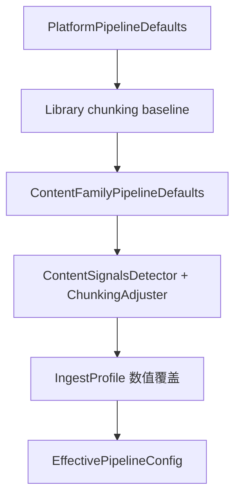

# ContentFamily + ContentSignals 设计方案

> 版本：v1（2026-06）  
> 关联：[INGEST-PIPELINE.md §5](./INGEST-PIPELINE.md#5-三层配置矩阵)、[FILE-TYPE-PROCESSING.md](./FILE-TYPE-PROCESSING.md)

## 1. 目标

在「库级分块数值统一」与「异构文件分块质量」之间取得平衡：

1. **MIME 上层族群（ContentFamily）** 自动选择解析/清洗/分块策略基线。
2. **解析后内容信号（ContentSignals）** 在同 MIME 内做二次路由（短文降级、长文标题升级等）。
3. **库级 chunkSize/overlap** 保持统一；**ingest profile** 仅白名单数值覆盖。
4. **入库可观测**：`ingest_report_json` 记录族群、最终策略、调整原因。

北极星指标：**RAG 可答率**；本子系统负责其中的 **有证据召回率** 与 **入库质量可观测**。

---

## 2. 配置层级（合并后）



| 层级 | 管辖 | 禁止 |
|------|------|------|
| 平台 | 解析/清洗基线对象 | 库 JSON 存 parsing |
| 库级 | chunkSize/overlap/embedding/retrieval | 按 MIME 手改 strategy |
| ContentFamily | strategy、parsing 片段、清洗族 | embedding 变更 |
| ContentSignals | **仅** strategy 升降级 | chunkSize 变更 |
| IngestProfile | chunkSize/overlap/minParagraphLength | parsing/cleaning |

---

## 3. ContentFamily 族群

| 枚举 | MIME 示例 | 默认 strategy | 解析要点 |
|------|-----------|---------------|----------|
| `TABULAR` | xlsx/xls/csv | `paragraph-first` | `text-only`，禁 structured |
| `DOCUMENT` | pdf/doc/docx | Word: `heading-level`；PDF: `paragraph-first` | Word structured 表格 |
| `PLAIN` | txt/md | txt: `paragraph-first`；md: `heading-level` | 编码自动检测 |
| `IMAGE` | png/jpg | `paragraph-first` | OCR 跟系统开关 |
| `UNKNOWN` | 其他 | 保留库/平台基线 | — |

**映射类：** `ContentFamilyResolver`  
**默认应用：** `ContentFamilyPipelineDefaults`  
**MIME 门面（兼容）：** `MimeTypePipelineDefaults` → 委托族群层

---

## 4. ContentSignals 探测点

**接口：** `ContentSignalsDetector`  
**实现：** `DefaultContentSignalsDetector`（启发式，无 ML）

| 信号字段 | 探测方式 | 用途 |
|----------|----------|------|
| `textLength` | 字符数 | 短文判定（&lt; 2000） |
| `headingLineCount` / `headingLineRatio` | `#` 标题、中文章节行 | 长文档升级 heading |
| `markdownHeadings` | `^#{1,6}\s` | MD 长文升级 |
| `codeFences` | ` ``` ` | 禁止 semantic 降级 |
| `tabularLineRatio` | `\t` 或 `\|...\|` 行占比 | 可观测（v2 可参与路由） |
| `shortDocument` | length &lt; SHORT_DOCUMENT_CHARS | 降级 heading |

**调整类：** `ContentSignalsChunkingAdjuster`

| 规则 ID | 条件 | 动作 |
|---------|------|------|
| `tabular-family-force-paragraph-first` | TABULAR 族 | 强制 paragraph-first |
| `code-fences-downgrade-semantic` | 含代码围栏 + semantic | → paragraph-first |
| `short-document-downgrade-heading` | DOCUMENT + 短文 + heading-level | → paragraph-first |
| `document-heading-density-upgrade` | DOCUMENT + 标题密度 ≥ 5% + 非短文 | → heading-level |
| `markdown-headings-upgrade` | PLAIN + MD 标题 + 非短文 | → heading-level |

**不调整：** `chunkSize`、`chunkOverlap`（库级 + ingest profile）。

---

## 5. EffectiveConfigResolver 分叉

| 方法 | 时机 | 内容信号 |
|------|------|----------|
| `forDocument` / `forIngest` | **解析前**（extract/OCR 选项） | 否 |
| `forDocumentWithContent` / `forIngestWithContent` | **分块前**（索引/预览） | 是 |

解析与分块故意两阶段：`DocumentPipelineService` 解析前用 `forDocument`；`LibraryChunkPipeline` 分块时用 `*WithContent`。

---

## 6. 可观测性

`EffectivePipelineConfig` 携带：

- `contentFamily()`
- `contentSignals()`（含 `chunkingAdjustmentReason`）

`ChunkPipelineResult` → `IngestReport` 持久化：

- `contentFamily`
- `chunkingStrategy`
- `chunkingAdjustmentReason`
- `pipelineConfigVersion`（库级代际）

---

## 7. 代码锚点

| 类 | 路径 |
|----|------|
| `ContentFamily` | `pipeline/content/ContentFamily.java` |
| `ContentFamilyResolver` | `pipeline/content/ContentFamilyResolver.java` |
| `ContentSignals` | `pipeline/content/ContentSignals.java` |
| `ContentSignalsDetector` | `pipeline/content/ContentSignalsDetector.java` |
| `DefaultContentSignalsDetector` | `pipeline/content/DefaultContentSignalsDetector.java` |
| `ContentSignalsChunkingAdjuster` | `pipeline/content/ContentSignalsChunkingAdjuster.java` |
| `ContentFamilyPipelineDefaults` | `pipeline/content/ContentFamilyPipelineDefaults.java` |
| `EffectiveConfigResolver` | `pipeline/config/EffectiveConfigResolver.java` |

---

## 8. Phase 2 已实现

| 能力 | 实现 |
|------|------|
| 族群级 chunkSize cap | `ContentFamilyChunkBounds` — 在 `EffectiveConfigResolver.resolve` 中 MIME 覆盖后收紧 |
| ContentSignals 持久化 | `doc_metadata.content_signals_json`；解析完成与索引时写入 |
| 多粒度索引 | `HierarchicalChunkingPolicy` + `HierarchicalChunker`：heading 父段 + paragraph 子块；子块嵌入，父上下文写入 chunk metadata |
| RAG 父上下文扩展 | `SearchHit.parentContext` + `contextForPrompt()`；`RagPromptBuilder` / `RagService` citation 使用扩展上下文 |

**启用条件（多粒度）：** `HEADING_LEVEL` + DOCUMENT/PLAIN 族群 + 非短文 + 文本 ≥ 600 字。

**已有库迁移**（`init.sql` 仅对新库生效）：

```powershell
$env:PGPASSWORD='knowbase'
psql -h localhost -U knowbase -d knowbase -f infra/postgres/migrate-content-signals-json.sql
```

## 10. 前端展示（knowbase-ui）

| 页面 | 展示内容 |
|------|----------|
| `DocumentChunksView` | 管道路由（族群/策略/多粒度/信号调整）、内容结构信号、入库报告指标 |
| `DocumentsView` | 列表/卡片 `多粒度`、`GATE-01` 标签 |
| `IngestView` 预览 | chunk-preview 返回的管道 trace 标签（与入库一致） |
| `IngestView` 规则 | 只读说明：族群路由、多粒度默认开启、族群粒度范围 |

工具：`contentPipeline.js`、`ingestReport.js`（`pipelineTraceSummary` / `contentSignalsSummary`）。

**无库级多粒度开关** — 后端 `HierarchicalChunkingPolicy` 按条件自动启用。

**后续（未实现）：**

- parse 后 OCR 与 signals 联动增强（扫描 PDF 已由 `OcrFallbackPolicy` 在解析层处理）。

---

## 9. 验证

```bash
cd knowbase-service
mvn test -Dtest=ContentFamilyResolverTest,DefaultContentSignalsDetectorTest,ContentSignalsChunkingAdjusterTest,EffectiveConfigResolverContentSignalsTest,EffectiveConfigResolverMimeTest,MimeTypePipelineDefaultsTest,LibraryChunkPipelineParityTest
```
