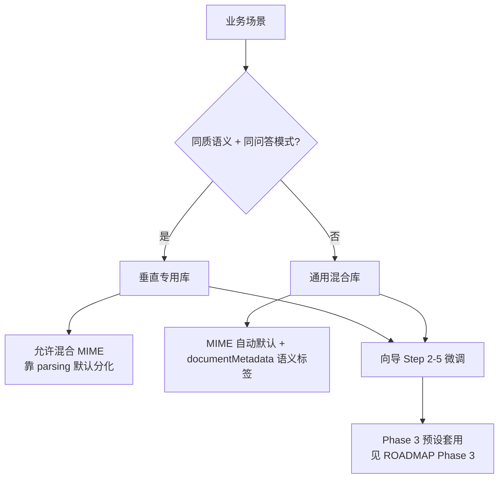

# 建库与入库全链路

**Analysis Date:** 2026-06-10

> **Phase 1 说明：** 本里程碑为**文档-only**交付，不修改应用代码。目标态叙述为主（D-01），现状差距在各章「当前差距」与附录 A 标注。

## 目录

| 受众 | 锚点 | 推荐阅读章节 |
|------|------|--------------|
| 运营 | [#ops-guide](#ops-guide) | §6 库类型选型决策树、§7 分块质量准则、§8 反模式 |
| 开发 | [#dev-reference](#dev-reference) | §2 建库流程、§3 单文档入库流程、§5 三层配置矩阵、附录 A/B |

---

## §1 范围与读者指南 {#ops-guide} {#dev-reference}

### 里程碑核心价值

> **Core Value（PROJECT.md）：** 运营人员按文件类型选对库预设并完成采集后，**预览所见分块与入库结果一致**，且分块内容足以支撑后续检索与问答（不因错误设定导致表头块、续行拆开、OCR 缺失等问题）。

### 目标态 vs v1 交付边界（D-01、D-02）

| 维度 | 目标态（文档叙述） | v1 里程碑交付 |
|------|-------------------|---------------|
| 库类型谱系 | 垂直专用库 + **通用混合库一等公民**（D-09） | 文档描述选型决策树与配置路径；预设 UI 见 Phase 3 |
| 配置层级 | 系统 / 库默认 / 采集覆盖三层（D-03–D-07） | 配置矩阵标注「现状」列；采集 profile 未实现 |
| 质量验收 | RAG 可答率为**北极星**（D-16） | v1 验收 = **检索可召回** + 反模式样本；**不**将 RAG 答对率纳入工程验收 |
| 按类型细表 | 引用 Phase 2 `FILE-TYPE-PROCESSING.md`（D-17） | Phase 1 仅通用准则，不重复 per-type 矩阵 |

**D-01：** 本文以合理目标架构为主叙述，不以「仅描述现有代码」为约束；各章末尾「当前差距」对照 `LibraryConfigResolver`、`lockPipeline`、`overrideChunk` 等现状。

**D-02：** 愿景包含通用库一等公民；v1 交付流程文档 + 召回层质量准则 + 反模式样本。

### 需求可追溯

| Requirement | Section | Status |
|-------------|---------|--------|
| PIPE-01 | §2 建库流程 | Plan 01-01 |
| PIPE-02 | §3 单文档入库流程 | Plan 01-02 |
| PIPE-03 | §4 阶段·类·API 对照 | Plan 01-02 |

### 按文件类型处理

Phase 1 **不**展开 PDF/Word/Excel/TXT/Markdown 逐类型矩阵（D-17）。详见 Phase 2 交付物 [`.planning/docs/FILE-TYPE-PROCESSING.md`](./FILE-TYPE-PROCESSING.md)（待创建）。

---

## §2 建库流程（PIPE-01）

（Plan 01-01 Task 3 填充）

---

## §3 单文档入库流程（PIPE-02）

（Plan 02 填充）

---

## §4 阶段·类·API 对照（PIPE-03）

（Plan 02 填充）

---

## §5 三层配置矩阵

配置边界遵循 D-03–D-07：行 = 规则项，列 = 系统级 / 库默认 / 采集覆盖（目标态）/ 现状。单元格标注 **必须** / **默认** / **可覆盖** / **禁止**。

### 5.1 规则矩阵

| 规则项 | 配置路径 | 系统级 | 库默认 | 采集覆盖（目标态） | 现状 | Resolver 方法 |
|--------|----------|--------|--------|-------------------|------|---------------|
| 单文件大小上限 | — (`application.yml`) | **必须** `ingest.max-file-size` | 禁止 | 禁止 | 系统固定 | — |
| 批量上传文件数 | — | **必须** `ingest.max-batch-files` | 禁止 | 禁止 | 系统固定 | — |
| 全局 MIME 白名单 | — | **必须** `ingest.allowed-mime-types` | **默认** 可收窄 `ingestAccess.supportedFileTypes` | 禁止 | 库可收窄 | `allowedMimeTypes(libraryId)` |
| OCR 引擎可用性 | `ingest.ocr.enabled` | **必须** 系统开关 + tessdata | — | — | 无 tessdata 则 OCR 失败 | — |
| Embedding 模型/维度 | `embeddingProvider`, `embeddingModel`, `embeddingDimension` | **默认** `ollama.embedding-model`, `embedding.dimension` 兜底 | **必须** 库内统一 | 目标态可覆盖 + 全库重索引 | 库级 | `embeddingFor(libraryId)` |
| Hybrid / Rerank | `retrieval.hybridSearchEnabled`, `retrieval.rerankEnabled` | — | **必须** 库内统一 | 禁止 | 库级 | `retrievalFor(libraryId)` |
| 元数据过滤白名单 | `retrieval.metadataFilterFields` | — | **必须** 库内统一 | 禁止 | 库级 | `retrievalFor(libraryId)` |
| 容量上限 | `ingestAccess.capacityLimits.*` | — | **必须** 库内统一 | 禁止 | 库级 | `capacityLimitsFor(libraryId)` |
| 版本策略 | `ingestAccess.versionPolicy.*` | — | **必须** 库内统一 | 禁止 | 库级 | `versionPolicyFor(libraryId)` |
| 解析规则 | `parsing.*` | — | **默认** | **可覆盖** OCR/chunk 等（ingest profile） | **库级 only** | `parseOptionsFor(libraryId)` |
| 文本规范化 | `textNormalizationEnabled`, `textNormalization.*` | **默认** 全局 `TextNormalizationProperties` | **默认** | 目标态可覆盖 | 库级 | `normalizationFor(libraryId)` |
| 内容清洗 | `cleaning.*` | — | **默认** | **可覆盖** | **库级 only** | `cleaningFor(libraryId)` |
| 分块策略 | `chunkingStrategy`, `chunkSize`, `chunkOverlap`, `minChunkSize`, `maxChunkSize`, `minParagraphLength`, `normalizeBeforeChunk`, `semanticSimilarityThreshold` | **默认** `chunking.semantic-similarity-threshold` 兜底 | **默认** | **可覆盖** | **库级 only**；预览可 `overrideChunk`（仅预览） | `chunkingFor(libraryId)` |
| 入库审核模式 | `governance.ingestReviewMode` | — | **默认** | 禁止 | 库级 | `requiresManualReview(libraryId)` |
| 语义标签 | `documentMetadata`（采集参数） | — | — | **可覆盖** 写入 `custom_metadata_json` | **仅检索过滤**，不驱动解析/分块管道（D-06） | — → `ChunkMetadataBuilder` |
| 上传模式 | `ingestSourceMode` | — | **必须** | 禁止 | 库级；`crawl` 库禁止上传 | `isUploadAllowed(libraryId)` |

**D-06 说明：** v1 中 `documentMetadata` 为**语义标签**（检索过滤），**不**驱动解析/分块管道。采集级 ingest profile（OCR/chunk 覆盖持久化）为**目标态**，v1 **未实现**。

**字段路径命名**与 `frontend/knowbase-ui/src/utils/libraryConfig.js` 中 `CONFIG_FIELD_SPECS` / `REINDEX_FIELDS` dot-path 对齐。

### 5.2 Resolver 方法 → 消费方

| Resolver 方法 | 配置路径组 | 主要消费方 |
|---------------|-----------|-----------|
| `config(libraryId)` | 全量 `config_json` | 所有阶段入口 |
| `parseOptionsFor(libraryId)` | `parsing.*` | `DocumentParseService`, `DocumentPipelineService`, `ParsePreviewService` |
| `normalizationFor(libraryId)` | `textNormalization.*` | `DocumentPipelineService`, `ChunkPreviewService` |
| `cleaningFor(libraryId)` | `cleaning.*` | `DocumentPipelineService`, `IndexingService`, `ChunkPreviewService` |
| `chunkingFor(libraryId)` | `chunkingStrategy`, `chunkSize`, … | `IndexingService` → `ChunkingService`, `ChunkPreviewService` |
| `embeddingFor(libraryId)` | `embeddingProvider/Model/Dimension` | `LibraryEmbeddingService`（`IndexingService` 内） |
| `retrievalFor(libraryId)` | `retrieval.*` | `VectorSearchService`, `RagRetrievalService`; `retainChunkMetadata` → `ChunkMetadataBuilder` |
| `allowedMimeTypes(libraryId)` | `ingestAccess.supportedFileTypes` | `UploadService`, `DocumentIngestor`, `MimeTypeAllowlist` |
| `capacityLimitsFor(libraryId)` | `ingestAccess.capacityLimits.*` | `LibraryCapacityValidator` |
| `versionPolicyFor(libraryId)` | `ingestAccess.versionPolicy.*` | `DocumentIngestor` 重复版本处理 |
| `requiresManualReview(libraryId)` | `governance.ingestReviewMode` | `DocumentIngestor.resolveIndexRequested` |
| `isUploadAllowed(libraryId)` | `ingestSourceMode` | 阻止 crawl-only 库上传 |

### 当前差距

**现状：** 整条 ingest 管道（解析 / 清洗 / 分块 / 嵌入）规则**锁定在库级**——`LibraryConfigResolver.*For(libraryId)` 为唯一运行时来源；无持久化 ingest profile。`documentMetadata` 仅进入 chunk 元数据供检索过滤。

**目标态：** 库级为默认值，采集级可覆盖白名单内字段（OCR、chunk 参数等），变更触发重索引（D-15 软锁定）。完整差距表见附录 A（Plan 03）。

---

## §6 库类型选型决策树

库类型谱系（D-08–D-12）：**垂直专用库**（同质语义，可混合文件类型）与 **通用混合库**（多类型多语义）均为目标态一等公民（D-09）。

### 6.1 决策流程

> **Phase 3 占位：** 预设（周报库、制度文档库等）由 Phase 3 `libraryPresets.js` + 向导 UI 交付；本文不展开预设定义。

### 6.2 启发式清单（D-10、D-11）

- **同质语义 + 混合类型 → 同垂直库：** 例：周报 xlsx + 周报 pdf 导出 → **同一垂直专用库**；靠 MIME 感知默认（Excel→`text-only`+`paragraph-first`；PDF→OCR 按需）分化处理。
- **异质语义 + 同扩展名 → 拆库：** 例：周报 xlsx vs 报销 xlsx → **应拆为两个库**（语义主轴不同，问答模式不同）。
- **不以扩展名为唯一依据：** 建库决策以**业务语义 + 问答模式**为主轴，扩展名/MIME 仅影响解析默认，不决定库边界。
- **通用混合库（D-09）：** 目标态通过 MIME 自动默认 + 采集 `documentMetadata` 语义标签（如 `semanticType=weekly-report`）+ 库级检索配置，力争分块质量可支撑 RAG；v1 文档描述路径，**MIME 自动默认引擎未实现**（Phase 2/3 backlog）。

---

## §7 分块质量准则

（Plan 03 填充）

---

## §8 反模式对照

（Plan 03 填充）

---

## 附录 A：当前差距详表

（Plan 03 填充）

---

## 附录 B：Backlog 与字段路径索引

（Plan 03 填充）
