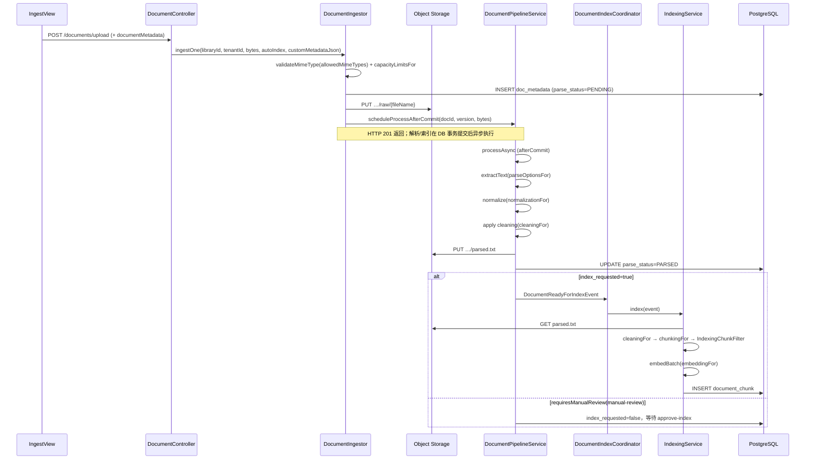
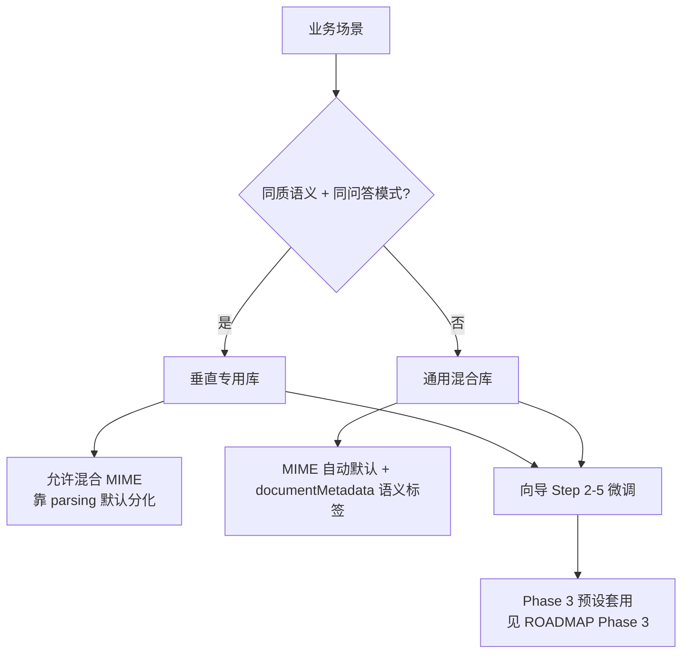

# 建库与入库全链路

**Analysis Date:** 2026-06-10

> **Phase 1 说明：** 本里程碑为**文档-only**交付，不修改应用代码。目标态叙述为主（D-01），现状差距在各章「当前差距」与附录 A 标注。

## 目录

| 受众 | 锚点 | 推荐阅读章节 |
|------|------|--------------|
| 运营 | [#ops-guide](#ops-guide) | §6 库类型选型决策树、§7 分块质量准则、§8 反模式 |
| 开发 | [#dev-reference](#dev-reference) | §2 建库流程、§3 单文档入库流程、§5 三层配置矩阵、附录 A/B |

---

## §1 范围与读者指南 {#ops-guide} {#dev-reference}

### 里程碑核心价值

> **Core Value（PROJECT.md）：** 运营人员按文件类型选对库预设并完成采集后，**预览所见分块与入库结果一致**，且分块内容足以支撑后续检索与问答（不因错误设定导致表头块、续行拆开、OCR 缺失等问题）。

### 目标态 vs v1 交付边界（D-01、D-02）

| 维度 | 目标态（文档叙述） | v1 里程碑交付 |
|------|-------------------|---------------|
| 库类型谱系 | 垂直专用库 + **通用混合库一等公民**（D-09） | 文档描述选型决策树与配置路径；预设 UI 见 Phase 3 |
| 配置层级 | 系统 / 库默认 / 采集覆盖三层（D-03–D-07） | 配置矩阵标注「现状」列；采集 profile 未实现 |
| 质量验收 | RAG 可答率为**北极星**（D-16） | v1 验收 = **检索可召回** + 反模式样本；**不**将 RAG 答对率纳入工程验收 |
| 按类型细表 | 引用 Phase 2 `FILE-TYPE-PROCESSING.md`（D-17） | Phase 1 仅通用准则，不重复 per-type 矩阵 |

**D-01：** 本文以合理目标架构为主叙述，不以「仅描述现有代码」为约束；各章末尾「当前差距」对照 `LibraryConfigResolver`、`lockPipeline`、`overrideChunk` 等现状。

**D-02：** 愿景包含通用库一等公民；v1 交付流程文档 + 召回层质量准则 + 反模式样本。

### 需求可追溯

| Requirement | Section | Status |
|-------------|---------|--------|
| PIPE-01 | §2 建库流程 | Covered |
| PIPE-02 | §3 单文档入库流程 | Covered |
| PIPE-03 | §4 阶段·类·API 对照 | Covered |

### 按文件类型处理

Phase 1 **不**展开 PDF/Word/Excel/TXT/Markdown 逐类型矩阵（D-17）。详见 Phase 2 交付物 [`.planning/docs/FILE-TYPE-PROCESSING.md`](./FILE-TYPE-PROCESSING.md)（待创建）。

---

## §2 建库流程（PIPE-01）

建库将运营在向导中填写的规则持久化为 `vector_library.config_json`，后续 ingest 管道各阶段通过 `LibraryConfigResolver.*For(libraryId)` 读取。

### 2.1 端到端流程

```mermaid
flowchart LR
    subgraph Client["Browser — Vue SPA"]
        Wiz["CreateLibraryWizard"]
        Edit["EditLibrarySettingsDrawer"]
    end
    subgraph API["knowbase-service"]
        VLC["VectorLibraryController"]
        VLS["VectorLibraryService"]
        LCR["LibraryConfigResolver"]
    end
    subgraph DB["PostgreSQL"]
        VL[("vector_library.config_json")]
    end
    subgraph Runtime["首次入库及后续"]
        DPS["DocumentPipelineService"]
        IS["IndexingService"]
    end

    Wiz -->|POST /api/v1/vector-libraries| VLC
    Edit -->|PUT /api/v1/vector-libraries/{id}| VLC
    VLC --> VLS
    VLS -->|create / updateSettings| VL
    VL --> LCR
    LCR --> DPS
    LCR --> IS
```

### 2.2 向导步骤 ↔ config_json 字段

来源：`frontend/knowbase-ui/src/utils/libraryDefaults.js` — `WIZARD_STEPS` + `defaultLibraryConfig()`。

| Wizard 步骤 | 主要 config_json 路径 | 库默认示例值 |
|-------------|----------------------|-------------|
| **1 基础信息** | `name`, `description`（API 顶层）；`tags` | `tags: []` |
| **2 数据类型与容量** | `ingestAccess.supportedFileTypes`, `ingestAccess.capacityLimits.*`, `ingestAccess.versionPolicy.*`, `ingestSourceMode` | `supportedFileTypes: ['pdf','word','txt','markdown','excel']`; `maxDocuments: 10000` |
| **3 文档处理规则** | `parsing.*`, `cleaning.*`, `textNormalizationEnabled`, `textNormalization.*`, `chunkingStrategy`, `chunkSize`, `chunkOverlap`, `minChunkSize`, `maxChunkSize`, `minParagraphLength`, `normalizeBeforeChunk`, `semanticSimilarityThreshold` | `parsing.ocrEnabled: false`, `tableExtraction: 'text-only'`; `chunkingStrategy: 'paragraph-first'`, `chunkSize: 500` |
| **4 索引与检索** | `embeddingProvider`, `embeddingModel`, `embeddingDimension`, `retrieval.*` | `embeddingModel: 'nomic-embed-text'`, `embeddingDimension: 768`; `hybridSearchEnabled: true` |
| **5 治理与安全** | `governance.*` | `ingestReviewMode: 'auto'` |

前端提交：`buildCreatePayload()` 合并 `defaultLibraryConfig(wizardMode)` → `createVectorLibrary()` → `POST /api/v1/vector-libraries`。

后端持久化：

```java
// VectorLibraryService.create
VectorLibraryConfig cfg = request.config() != null ? request.config() : defaultConfig();
lib.setConfigJson(JsonSupport.toJson(cfg));
mapper.insert(lib);
```

### 2.3 config_json → LibraryConfigResolver 生效点

| Resolver 方法 | 配置路径组 | 主要消费方 |
|---------------|-----------|-----------|
| `config(libraryId)` | 全量 JSONB | 解析入口 |
| `parseOptionsFor(libraryId)` | `parsing.*` | `DocumentParseService`, `DocumentPipelineService`, `ParsePreviewService` |
| `normalizationFor(libraryId)` | `textNormalization.*` | `DocumentPipelineService`, `ChunkPreviewService` |
| `cleaningFor(libraryId)` | `cleaning.*` | `DocumentPipelineService`, `IndexingService`, `ChunkPreviewService` |
| `chunkingFor(libraryId)` | `chunkingStrategy`, `chunkSize`, … | `IndexingService` → `ChunkingService`, `ChunkPreviewService` |
| `embeddingFor(libraryId)` | `embeddingProvider/Model/Dimension` | `LibraryEmbeddingService` |
| `retrievalFor(libraryId)` | `retrieval.*` | `VectorSearchService`, `RagRetrievalService`, `ChunkMetadataBuilder` |
| `allowedMimeTypes(libraryId)` | `ingestAccess.supportedFileTypes` | `UploadService`, `DocumentIngestor` |
| `capacityLimitsFor(libraryId)` | `ingestAccess.capacityLimits.*` | `LibraryCapacityValidator` |
| `versionPolicyFor(libraryId)` | `ingestAccess.versionPolicy.*` | `DocumentIngestor` |
| `requiresManualReview(libraryId)` | `governance.ingestReviewMode` | `DocumentIngestor.resolveIndexRequested` |

### 2.4 数据流（建库 → 首次入库）

1. 运营在 `CreateLibraryWizard` 填写各步骤表单（或 `EditLibrarySettingsDrawer` 后续修改）。
2. 前端 `buildCreatePayload()` 组装 `{ tenantId, name, description, tags, config }`。
3. `POST /api/v1/vector-libraries` → `VectorLibraryController.create` → `VectorLibraryService.create`。
4. 服务端将 `VectorLibraryConfig` 序列化为 JSONB 写入 `vector_library.config_json`。
5. 首次文档上传时，`DocumentIngestor` / `DocumentPipelineService` / `IndexingService` 调用 `LibraryConfigResolver.*For(libraryId)` 读取对应规则。
6. 解析、清洗、分块、嵌入各阶段均从 resolver 获取库级配置（现状无采集级覆盖）。
7. 配置变更走 `PUT /api/v1/vector-libraries/{id}` → `updateSettings`；若库内已有文档/chunk 则触发 `lockPipeline`（见 2.5）。
8. Chunk 元数据与检索规则在索引阶段由 `retrievalFor` / `ChunkMetadataBuilder` 生效。

### 2.5 当前差距

| 差距 | 现状 | 目标态（D-15） |
|------|------|----------------|
| **lockPipeline** | `documentCount > 0 \|\| chunkCount > 0` 时 **硬锁**：`VectorLibraryConfigMerger` 跳过 parsing/cleaning/chunking/embedding 更新 | **软锁定**：允许修改管道规则，但必须触发**全库重索引**任务 + UI 强警告 |
| **库类型轴** | 向导仅有 quick/advanced 模式，**无**垂直/通用库类型选择 UI | 决策树（§6）为文档-only，Phase 3 预设 + 类型轴 |
| **重索引** | 手动 `POST /api/v1/index/rebuild-library` 可部分补救 | 配置变更自动触发重索引任务（backlog） |

```java
// VectorLibraryService.updateSettings
boolean lockPipeline = documentCount > 0 || chunkCount > 0;
VectorLibraryConfigMerger.mergeSafeFields(existing, request.config(), lockPipeline);
```

### 代码锚点

- `frontend/knowbase-ui/src/components/CreateLibraryWizard.vue` — 建库向导
- `frontend/knowbase-ui/src/components/EditLibrarySettingsDrawer.vue` — 库设置与 lockPipeline UI
- `frontend/knowbase-ui/src/utils/libraryDefaults.js` — `WIZARD_STEPS`, `defaultLibraryConfig`, `buildCreatePayload`
- `frontend/knowbase-ui/src/api/library.js` — `createVectorLibrary`, `updateVectorLibrarySettings`
- `knowbase-service/.../VectorLibraryController.java` — `POST/PUT /api/v1/vector-libraries`
- `knowbase-service/.../VectorLibraryService.java` — `create`, `updateSettings`
- `knowbase-service/.../LibraryConfigResolver.java` — 运行时配置解析
- `knowbase-service/.../VectorLibraryConfigMerger.java` — lockPipeline 合并逻辑

---

## §3 单文档入库流程（PIPE-02）

单文档从 `IngestView` 上传到 `document_chunk` 写入 pgvector 的完整路径。各阶段配置均来自 `LibraryConfigResolver.*For(libraryId)`（v1 无采集级覆盖）。

### 3.1 端到端时序图



### 3.2 阶段 × 关键类 × 配置来源

| # | 阶段 | 关键类 | 配置来源 (`LibraryConfigResolver`) | 持久化/输出 |
|---|------|--------|-----------------------------------|-------------|
| 1 | 上传校验 | `DocumentIngestor`, `UploadService`, `LibraryCapacityValidator` | `allowedMimeTypes(libraryId)`, `capacityLimitsFor(libraryId)`, `versionPolicyFor(libraryId)` | `doc_metadata`；Object Storage `…/v{n}/raw/{fileName}` |
| 2 | 异步解析 | `DocumentPipelineService.processAsync`, `DocumentParseService` | `parseOptionsFor(libraryId)` | 内存 plainText（随后写入 `parsed.txt`） |
| 3 | 文本规范化 | `ParsedTextNormalizer` | `normalizationFor(libraryId)`（受 `config(libraryId).textNormalizationEnabled` 门控） | 管道内文本 |
| 4 | 内容清洗 | `DocumentCleaningService` | `cleaningFor(libraryId)` | Object Storage `…/v{n}/parsed.txt` |
| 5 | 索引触发 | `DocumentIndexCoordinator`, `DocumentIngestor.resolveIndexRequested` | `requiresManualReview(libraryId)` → `index_requested` / `index_status` | `document_index_job`；manual-review 时需 `POST …/approve-index` |
| 6 | 分块 | `ChunkingService`（`IndexingService` 内） | `chunkingFor(libraryId)` | 内存 chunk 列表 |
| 7 | 表头过滤 | `IndexingChunkFilter.removeHeaderOnlyChunks` | —（启发式，非 resolver 字段） | 过滤后 chunk 列表 |
| 8 | 嵌入写入 | `LibraryEmbeddingService`, `DocumentChunkMapper` | `embeddingFor(libraryId)` | `document_chunk`（content + embedding vector） |
| 9 | Chunk 元数据 | `ChunkMetadataBuilder`（`IndexingService.resolveChunkMetadataJson`） | `retrievalFor(libraryId)` + `doc_metadata.custom_metadata_json` | `document_chunk.metadata` JSONB |

### 3.3 documentMetadata 数据流（D-06）

1. `IngestView.resolveDocumentMetadataParam()` — 校验 JSON 对象（`IngestView.vue:957`）
2. 作为 query param `documentMetadata` 传入 `uploadDocument` / `uploadDocumentsBatch`（`ingest.js` `uploadParams`）
3. `DocumentIngestor.ingestOne` → `DocumentCustomMetadataSupport.normalizeJson` → `doc_metadata.custom_metadata_json`
4. `IndexingService.resolveChunkMetadataJson` → `ChunkMetadataBuilder.mergeCustomMetadata` → 每个 chunk 的 metadata

**v1 语义：** `documentMetadata` 为**语义标签**（检索过滤），**不**改变 parse/chunk 参数。采集级 ingest profile（OCR/chunk 覆盖持久化）为目标态 backlog。

### 3.4 事务提交后异步（Pattern 2）

`DocumentPipelineService.scheduleProcessAfterCommit` 注册 `TransactionSynchronization.afterCommit`，在 `doc_metadata` 与 `raw/` 对象提交后再启动 `processAsync`。因此 `POST /documents/upload` 返回 `201` 时 `parse_status=PENDING`，客户端需轮询文档状态或列表 API 观察 `PARSED` / 索引完成。该模式避免解析任务读到未提交的 doc 行或 storage key 竞态。

反模式与预览分叉详见 §8 与附录 A；本节不展开。

### 代码锚点

- `frontend/knowbase-ui/src/views/IngestView.vue` — 上传、预览、`documentMetadata`
- `knowbase-service/.../DocumentController.java` — upload / parse-preview / approve-index
- `knowbase-service/.../DocumentIngestor.java` — `ingestOne`, `storeAndProcess`
- `knowbase-service/.../DocumentPipelineService.java` — `scheduleProcessAfterCommit`, `processAsync`
- `knowbase-service/.../DocumentIndexCoordinator.java` — `processReadyForIndex`
- `knowbase-service/.../IndexingService.java` — `index`（chunk → filter → embed）
- `knowbase-service/.../IndexingChunkFilter.java` — `removeHeaderOnlyChunks`
- `knowbase-service/.../ChunkMetadataBuilder.java` — chunk metadata 合并

---

## §4 阶段·类·API 对照（PIPE-03）

开发对照表：从 UI 操作映射到 HTTP 端点、Controller 方法与后端服务类。路径已与 `@RequestMapping` 注解核对（2026-06-10）。

### 4.1 阶段·HTTP·类·前端矩阵

| 阶段 | HTTP Method + Path | Controller#method | 后端服务类 | 前端 `api/*.js` 函数 | UI 入口组件 |
|------|-------------------|-------------------|-----------|---------------------|------------|
| 建库列表 | `GET /api/v1/vector-libraries` | `VectorLibraryController#list` | `VectorLibraryService` | `library.js` `listVectorLibraries` | `VectorLibrariesView` |
| 建库 | `POST /api/v1/vector-libraries` | `VectorLibraryController#create` | `VectorLibraryService` | `library.js` `createVectorLibrary` | `CreateLibraryWizard` |
| 库设置 | `PUT /api/v1/vector-libraries/{libraryId}` | `VectorLibraryController#updateSettings` | `VectorLibraryService` | `library.js` `updateVectorLibrarySettings` | `EditLibrarySettingsDrawer`, `IngestView` |
| 上传约束 | `GET /api/v1/documents/upload-constraints` | `DocumentController#uploadConstraints` | `UploadService` | `ingest.js` `getUploadConstraints` | `IngestView` |
| 解析预览 | `POST /api/v1/documents/parse-preview` | `DocumentController#parsePreview` | `ParsePreviewService` | `ingest.js` `parsePreview` | `IngestView` |
| 分块预览 | `POST /api/v1/index/chunk-preview` | `IndexAdminController#chunkPreview` | `ChunkPreviewService` | `chunk.js` `previewChunks` | `IngestView`, `CreateLibraryWizard` |
| 单文件上传 | `POST /api/v1/documents/upload` | `DocumentController#upload` | `UploadService` → `DocumentIngestor` | `ingest.js` `uploadDocument`（query: `documentMetadata`） | `IngestView` |
| 批量上传 | `POST /api/v1/documents/upload/batch` | `DocumentController#uploadBatch` | `UploadService` → `DocumentIngestor` | `ingest.js` `uploadDocumentsBatch` | `IngestView` |
| 人工审核入库 | `POST /api/v1/documents/{docId}/approve-index` | `DocumentController#approveIndex` | `DocumentIndexApprovalService` | `ingest.js` `approveDocumentIndex` | —（`governance.ingestReviewMode=manual-review`） |
| 已入库分块 | `GET /api/v1/documents/{docId}/chunks` | `DocumentController#listChunks` | `DocumentChunkQueryService` | `ingest.js` `getDocumentChunks` | `DocumentChunksView`（质量验收锚点） |
| 全库重索引 | `POST /api/v1/index/rebuild-library` | `IndexAdminController#rebuildLibrary` | `LibraryRebuildService` | `vector.js` `rebuildLibrary` | —（lockPipeline 硬锁后的手动补救） |

### 4.2 组件职责表

| Component | Responsibility | File |
|-----------|----------------|------|
| `CreateLibraryWizard` | 五步向导收集库配置并 POST 建库 | `frontend/knowbase-ui/src/components/CreateLibraryWizard.vue` |
| `EditLibrarySettingsDrawer` | 库设置编辑；`lockPipeline` 时禁用管道字段 | `frontend/knowbase-ui/src/components/EditLibrarySettingsDrawer.vue` |
| `IngestView` | 采集入口：上传、双 API 预览、`documentMetadata`、`overrideChunk` UI | `frontend/knowbase-ui/src/views/IngestView.vue` |
| `LibraryConfigResolver` | 从 `config_json` 解析各阶段规则 | `knowbase-service/.../library/service/LibraryConfigResolver.java` |
| `DocumentIngestor` | 上传校验、写 `doc_metadata`、存 raw、触发管道 | `knowbase-service/.../ingest/service/DocumentIngestor.java` |
| `DocumentPipelineService` | afterCommit 异步解析/规范化/清洗、写 `parsed.txt`、触发索引 | `knowbase-service/.../ingest/service/DocumentPipelineService.java` |
| `DocumentIndexCoordinator` | 接收 `DocumentReadyForIndexEvent`，调度 `IndexingService` | `knowbase-service/.../platform/DocumentIndexCoordinator.java` |
| `IndexingService` | 读 `parsed.txt` → 分块 → 过滤 → 嵌入 → `document_chunk` | `knowbase-service/.../vector/service/IndexingService.java` |
| `IndexingChunkFilter` | 过滤表头-only 低价值块 | `knowbase-service/.../vector/chunk/IndexingChunkFilter.java` |
| `ChunkMetadataBuilder` | 合并 mimeType/docType/`custom_metadata_json` 到 chunk metadata | `knowbase-service/.../vector/retrieval/ChunkMetadataBuilder.java` |
| `ParsePreviewService` | 解析预览（extract-only，不入库） | `knowbase-service/.../ingest/service/ParsePreviewService.java` |
| `ChunkPreviewService` | 分块预览（不入库、不写 `document_chunk`） | `knowbase-service/.../vector/service/ChunkPreviewService.java` |

### 4.3 预览 API 分叉

`IngestView.runIngestPreview` 依次调用**两个独立 API**，均**不持久化** chunk：

1. `parsePreview(file, libraryId)` → `POST /api/v1/documents/parse-preview`（`ParsePreviewService`）
2. `fetchChunkPreview(buildChunkPreviewBody(parsed.text))` → `POST /api/v1/index/chunk-preview`（`ChunkPreviewService`）

与正式入库 `POST /documents/upload` → `DocumentPipelineService` → `IndexingService` 路径不同。预览与入库的路径差异及块数不一致详见 §4.4。

**目标态：** Phase 4 **PARITY** 要求预览规则 = 入库规则。完整四锚点差距表见[附录 A](#附录-a当前差距详表)；PARITY 需求见 `.planning/REQUIREMENTS.md` backlog。

### 4.4 当前差距：预览 vs 入库（D-14）

| 维度 | 预览路径 | 正式入库路径 | 差距 |
|------|----------|-------------|------|
| 解析来源 | `ParsePreviewService.preview` — 内存 extract-only，不写 storage | `DocumentPipelineService.processAsync` — 解析后持久化 `parsed.txt` | 预览跳过管道持久化；索引读已清洗的 stored text |
| 规范化/清洗顺序 | `ChunkPreviewService` 对请求 body 内 `sampleText` **重新** apply normalization + cleaning | 管道内已 normalize+clean 写入 `parsed.txt`；`IndexingService` **再次** `cleaningFor` 后分块 | 双次清洗 + 顺序差异 |
| 分块参数 | `IngestView.buildChunkPreviewBody` 可传 `overrideChunkSize`（`overrideChunkEnabled`） | `IndexingService` 仅 `libraryConfigResolver.chunkingFor(libraryId)` | `overrideChunk` **仅预览** |
| UI 文案 | `IngestView.vue:531` 显示「仅本次预览与入库」 | `ingest.js` `uploadParams` 只传 `documentMetadata`，**无** chunkSize | 文案误导运营 |
| 块数预期 | `chunk-preview` 返回 `totalChunks` / `rawTotalChunks` / `filteredOutCount` | `document_chunk` 行数（经 `IndexingChunkFilter`） | 参数或路径不同则 N≠M |

**代码锚点 — overrideChunk 预览专用：**

```javascript
// IngestView.vue:1132 — override 仅进入 chunk-preview body
const chunkSize = overrideChunkEnabled.value ? overrideChunkSize.value : sizing.chunkSize

// ingest.js:17-20 — upload 不传 chunk 覆盖
function uploadParams(libraryId, tenantId, autoIndex, documentMetadata) {
  const params = { libraryId, tenantId, autoIndex }
  if (documentMetadata?.trim()) params.documentMetadata = documentMetadata.trim()
  return params
}
```

**目标态（Phase 4 PARITY）：** 预览规则 = 入库规则；`overrideChunk` 要么同步传入入库管道，要么从 UI 移除。**现状预览不等于入库** — 勿将预览块数当作入库结果。`DocumentPipelineService` 与 `IndexingService` 锚点行见[附录 A](#附录-a当前差距详表)。

---

## §5 三层配置矩阵

配置边界遵循 D-03–D-07：行 = 规则项，列 = 系统级 / 库默认 / 采集覆盖（目标态）/ 现状。单元格标注 **必须** / **默认** / **可覆盖** / **禁止**。

### 5.1 规则矩阵

| 规则项 | 配置路径 | 系统级 | 库默认 | 采集覆盖（目标态） | 现状 | Resolver 方法 |
|--------|----------|--------|--------|-------------------|------|---------------|
| 单文件大小上限 | — (`application.yml`) | **必须** `ingest.max-file-size` | 禁止 | 禁止 | 系统固定 | — |
| 批量上传文件数 | — | **必须** `ingest.max-batch-files` | 禁止 | 禁止 | 系统固定 | — |
| 全局 MIME 白名单 | — | **必须** `ingest.allowed-mime-types` | **默认** 可收窄 `ingestAccess.supportedFileTypes` | 禁止 | 库可收窄 | `allowedMimeTypes(libraryId)` |
| OCR 引擎可用性 | `ingest.ocr.enabled` | **必须** 系统开关 + tessdata | — | — | 无 tessdata 则 OCR 失败 | — |
| Embedding 模型/维度 | `embeddingProvider`, `embeddingModel`, `embeddingDimension` | **默认** `ollama.embedding-model`, `embedding.dimension` 兜底 | **必须** 库内统一 | 目标态可覆盖 + 全库重索引 | 库级 | `embeddingFor(libraryId)` |
| Hybrid / Rerank | `retrieval.hybridSearchEnabled`, `retrieval.rerankEnabled` | — | **必须** 库内统一 | 禁止 | 库级 | `retrievalFor(libraryId)` |
| 元数据过滤白名单 | `retrieval.metadataFilterFields` | — | **必须** 库内统一 | 禁止 | 库级 | `retrievalFor(libraryId)` |
| 容量上限 | `ingestAccess.capacityLimits.*` | — | **必须** 库内统一 | 禁止 | 库级 | `capacityLimitsFor(libraryId)` |
| 版本策略 | `ingestAccess.versionPolicy.*` | — | **必须** 库内统一 | 禁止 | 库级 | `versionPolicyFor(libraryId)` |
| 解析规则 | `parsing.*` | — | **默认** | **可覆盖** OCR/chunk 等（ingest profile） | **库级 only** | `parseOptionsFor(libraryId)` |
| 文本规范化 | `textNormalizationEnabled`, `textNormalization.*` | **默认** 全局 `TextNormalizationProperties` | **默认** | 目标态可覆盖 | 库级 | `normalizationFor(libraryId)` |
| 内容清洗 | `cleaning.*` | — | **默认** | **可覆盖** | **库级 only** | `cleaningFor(libraryId)` |
| 分块策略 | `chunkingStrategy`, `chunkSize`, `chunkOverlap`, `minChunkSize`, `maxChunkSize`, `minParagraphLength`, `normalizeBeforeChunk`, `semanticSimilarityThreshold` | **默认** `chunking.semantic-similarity-threshold` 兜底 | **默认** | **可覆盖** | **库级 only**；预览可 `overrideChunk`（仅预览） | `chunkingFor(libraryId)` |
| 入库审核模式 | `governance.ingestReviewMode` | — | **默认** | 禁止 | 库级 | `requiresManualReview(libraryId)` |
| 语义标签 | `documentMetadata`（采集参数） | — | — | **可覆盖** 写入 `custom_metadata_json` | **仅检索过滤**，不驱动解析/分块管道（D-06） | — → `ChunkMetadataBuilder` |
| 上传模式 | `ingestSourceMode` | — | **必须** | 禁止 | 库级；`crawl` 库禁止上传 | `isUploadAllowed(libraryId)` |

**D-06 说明：** v1 中 `documentMetadata` 为**语义标签**（检索过滤），**不**驱动解析/分块管道。采集级 ingest profile（OCR/chunk 覆盖持久化）为**目标态**，v1 **未实现**。

**字段路径命名**与 `frontend/knowbase-ui/src/utils/libraryConfig.js` 中 `CONFIG_FIELD_SPECS` / `REINDEX_FIELDS` dot-path 对齐。

### 5.2 Resolver 方法 → 消费方

| Resolver 方法 | 配置路径组 | 主要消费方 |
|---------------|-----------|-----------|
| `config(libraryId)` | 全量 `config_json` | 所有阶段入口 |
| `parseOptionsFor(libraryId)` | `parsing.*` | `DocumentParseService`, `DocumentPipelineService`, `ParsePreviewService` |
| `normalizationFor(libraryId)` | `textNormalization.*` | `DocumentPipelineService`, `ChunkPreviewService` |
| `cleaningFor(libraryId)` | `cleaning.*` | `DocumentPipelineService`, `IndexingService`, `ChunkPreviewService` |
| `chunkingFor(libraryId)` | `chunkingStrategy`, `chunkSize`, … | `IndexingService` → `ChunkingService`, `ChunkPreviewService` |
| `embeddingFor(libraryId)` | `embeddingProvider/Model/Dimension` | `LibraryEmbeddingService`（`IndexingService` 内） |
| `retrievalFor(libraryId)` | `retrieval.*` | `VectorSearchService`, `RagRetrievalService`; `retainChunkMetadata` → `ChunkMetadataBuilder` |
| `allowedMimeTypes(libraryId)` | `ingestAccess.supportedFileTypes` | `UploadService`, `DocumentIngestor`, `MimeTypeAllowlist` |
| `capacityLimitsFor(libraryId)` | `ingestAccess.capacityLimits.*` | `LibraryCapacityValidator` |
| `versionPolicyFor(libraryId)` | `ingestAccess.versionPolicy.*` | `DocumentIngestor` 重复版本处理 |
| `requiresManualReview(libraryId)` | `governance.ingestReviewMode` | `DocumentIngestor.resolveIndexRequested` |
| `isUploadAllowed(libraryId)` | `ingestSourceMode` | 阻止 crawl-only 库上传 |

### 当前差距

**现状：** 整条 ingest 管道（解析 / 清洗 / 分块 / 嵌入）规则**锁定在库级**——`LibraryConfigResolver.*For(libraryId)` 为唯一运行时来源；无持久化 ingest profile。`documentMetadata` 仅进入 chunk 元数据供检索过滤。

**目标态：** 库级为默认值，采集级可覆盖白名单内字段（OCR、chunk 参数等），变更触发重索引（D-15 软锁定）。完整差距表见[附录 A](#附录-a当前差距详表)。

---

## §6 库类型选型决策树

库类型谱系（D-08–D-12）：**垂直专用库**（同质语义，可混合文件类型）与 **通用混合库**（多类型多语义）均为目标态一等公民（D-09）。

### 6.1 决策流程



> **Phase 3 占位：** 预设（周报库、制度文档库等）由 Phase 3 `libraryPresets.js` + 向导 UI 交付；本文不展开预设定义。

### 6.2 启发式清单（D-10、D-11）

- **同质语义 + 混合类型 → 同垂直库：** 例：周报 xlsx + 周报 pdf 导出 → **同一垂直专用库**；靠 MIME 感知默认（Excel→`text-only`+`paragraph-first`；PDF→OCR 按需）分化处理。
- **异质语义 + 同扩展名 → 拆库：** 例：周报 xlsx vs 报销 xlsx → **应拆为两个库**（语义主轴不同，问答模式不同）。
- **不以扩展名为唯一依据：** 建库决策以**业务语义 + 问答模式**为主轴，扩展名/MIME 仅影响解析默认，不决定库边界。
- **通用混合库（D-09）：** 目标态通过 MIME 自动默认 + 采集 `documentMetadata` 语义标签（如 `semanticType=weekly-report`）+ 库级检索配置，力争分块质量可支撑 RAG；v1 文档描述路径，**MIME 自动默认引擎未实现**（Phase 2/3 backlog）。

---

## §7 分块质量准则

分块质量分两层：**北极星指标**（长期目标）与 **v1 工程验收层**（本里程碑可检验）。两者不可混用——运营验收以 v1 层为准，产品愿景以北极星为准（D-16、D-17）。

### 7.1 北极星：RAG 可答率（D-16）

**定义：** 单个 chunk 内包含**足够自洽的事实**，使下游 RAG 在合理检索命中该块时，能够生成**正确、完整**的回答。

**特征（文档级描述，非 v1 自动化门禁）：**

- 块内信息可独立理解，不依赖未出现在同块或相邻块中的关键上下文
- 表格类内容：行级事实（责任人、项目、状态、说明）与表头语义在同一块或可关联块中可还原
- 叙述类内容：段落主题完整，不在句中或列表项中间被硬切

**边界：** RAG 可答率**不纳入 v1 工程验收**（D-02）。v2 可定义 GATE-01/02 门禁准则，见附录 B（D-19）。

### 7.2 v1 验收层：检索可召回

v1 里程碑以**检索可召回**为可检验标准——块进入向量/BM25 索引后，运营或开发能通过检索或 chunk 列表 API 找到预期事实，且块形态符合下列准则：

| 准则 | 说明 | 检验方式 |
|------|------|----------|
| **块自洽** | 块文本可独立阅读，关键字段不无故缺失 | `GET …/documents/{docId}/chunks` 或检索预览 |
| **非纯表头** | 索引块不以「序号\t类别\t…」类表头行为主内容 | `IndexingChunkFilter` 过滤 + chunk 内容抽查 |
| **关键事实不无故跨块断裂** | 同一工作项的续行、说明段不与主体行分离到不可关联的块 | 反模式样本：杜鹏飞周报（§8） |
| **预览=入库（目标态）** | 预览块数与规则应与正式入库一致 | **现状未满足** — 见 §4.4、§8、附录 A；Phase 4 PARITY |

**现状说明：** 「预览=入库」为目标态（D-14），v1 因 `overrideChunk` 仅预览、双 API 路径差异**尚未达成**。验收时勿将 `chunk-preview` 返回的 `totalChunks` 直接等同于 `document_chunk` 行数。

### 7.3 IndexingChunkFilter 角色

入库前，`IndexingService` 在 `ChunkingService.chunk` 之后调用 `IndexingChunkFilter.removeHeaderOnlyChunks`，移除 `WeeklyReportChunkHeuristics.isHeaderOnlyChunk` 判定为**纯表头**的低价值块。

```java
// IndexingChunkFilter.java — 若全部被判定为表头，保留原列表，避免文档完全无向量
return kept.isEmpty() ? List.copyOf(chunks) : kept;
```

**运营含义：**

- 正常情况：表头行不会单独进入向量索引，减少检索命中「序号/类别/责任人」列名而无数据行的噪声
- **Fallback：** 若启发式误杀导致「全部被滤除」，系统**回退保留全部块**，避免文档零向量——此时表头块仍可能可被检索到（见 §8 反模式「表头块占比过高」）

预览路径 `ChunkPreviewService` 同样应用该过滤器，并返回 `rawTotalChunks` / `filteredOutCount` / `totalChunks` 供 UI 展示。

### 7.4 ChunkMetadataBuilder 与检索收窄

每个 `document_chunk` 的 `metadata` JSONB 由 `ChunkMetadataBuilder.build` 写入，供 hybrid 检索与 `metadataFilterFields` 过滤：

| 字段 | 来源 | 用途 |
|------|------|------|
| `mimeType` | `doc_metadata.mime_type` | 按 MIME 收窄检索 |
| `fileName` | `doc_metadata.file_name` | 展示与按文件名过滤 |
| `docType` | 由扩展名/MIME 推导（pdf/word/excel/…） | 库级 `retrieval.metadataFilterFields` 白名单 |
| 自定义键值 | `doc_metadata.custom_metadata_json`（采集 `documentMetadata`） | 语义标签，如 `semanticType=weekly-report`（D-06） |

**v1 语义：** `documentMetadata` **仅**进入 chunk metadata 供检索过滤，**不**改变 parse/chunk 管道参数。

### 7.5 按文件类型的细表（Phase 2 引用）

Phase 1 **不**展开 PDF/Word/Excel/TXT/Markdown 逐类型推荐设定矩阵（D-17）。各类型「推荐 / 禁止」设定、产出形态与类型专属反模式见 Phase 2 交付物 [`.planning/docs/FILE-TYPE-PROCESSING.md`](./FILE-TYPE-PROCESSING.md)（待创建，TYPE-01–05）。

**Phase 1 通用建议（跨类型）：**

- 表格型 Excel 周报：`parsing.tableExtraction: text-only` + `chunkingStrategy: paragraph-first`（非 semantic）
- 扫描 PDF：`parsing.ocrEnabled: true` 且 tessdata 可用
- 异质语义文档：按 §6 决策树拆库，勿混库

---

## §8 反模式对照

下列为运营与开发在配置、采集、建库时**最常见**的错误模式。格式对齐 `.planning/codebase/CONCERNS.md` Tech Debt 条目，便于与代码库已知问题交叉检索（D-18）。

| 反模式 | 错误设定/行为 | 症状 | 代码锚点 | 正确做法（目标态 / Phase 引用） |
|--------|--------------|------|----------|--------------------------------|
| **预览≠入库** | 开启 `overrideChunkEnabled` 或信任 UI「仅本次预览与入库」文案 | 预览显示 N 块，入库 `document_chunk` 为 M 块（N≠M）；运营以为已验证入库结果 | `IngestView.vue`（`:531` 文案、`:1132` override 仅进 preview body）；`ingest.js` `uploadParams` 不传 chunkSize；`IndexingService` 仅 `chunkingFor(libraryId)` | **目标态：** Phase 4 **PARITY-01–04** — 预览规则=入库规则；**现状：** 以 `GET …/documents/{docId}/chunks` 为准，勿信预览块数 |
| **杜鹏飞周报 xlsx** | 错误分块策略（如 semantic）、忽略表头过滤认知，或 `tableExtraction: structured` 误以为对 xlsx 生效 | 检索命中纯表头块；或漏召回工作项行；续行与主体分离 | `ChunkPreviewServiceTest.previewUsesIndexingChunkFilterAndLibraryChunkParams` — 杜鹏飞 fixture；`IndexingChunkFilter.java`；`DocumentParseService`（Excel 走 Tika 纯文本） | **`paragraph-first` + `text-only`**；表头由 `IndexingChunkFilter` 过滤。**测试基准**（`chunkSize=500`, `chunkOverlap=120`）：`rawTotalChunks=4`, `filteredOutCount=1`, `totalChunks=3`[^dupengfei-count] |
| **扫描 PDF OCR 关闭** | 库或系统级 `parsing.ocrEnabled=false` 上传图片型 PDF | 解析文本为空或乱码；0 chunk 或无效向量 | `DocumentParseService.java`；`DocumentOcrService.java`；`infra/tesseract/README.md` | 开启 OCR + 运行 `scripts/setup-tesseract.ps1` 部署 tessdata；Phase 2 TYPE 矩阵对扫描 PDF 有专项说明 |
| **异质语义混库** | 周报 xlsx 与报销 xlsx 建在同一垂直库 | 检索噪声大；问答混淆不同业务语义 | CONTEXT **D-10**；`ChunkMetadataBuilder` 语义标签仅过滤不拆库 | 按**语义主轴**拆库（§6.2）；同质语义才混合 MIME |
| **Excel 误开 structured 表格** | `parsing.tableExtraction: structured` 用于 xlsx | 无结构化收益；运营误以为 Excel 会按行列对象入库 | `DocumentParseService.java`（structured 仅 HTML 管道）；`HtmlTableExtractionProcessor.java` | 保持 **`text-only`**；Excel 结构化 ingest 为 backlog（CONCERNS Tech Debt）；详见 Phase 2 **TYPE-03** |

[^dupengfei-count]: **参数脚注（RESEARCH Assumption A1）：** 单元测试在 `chunkSize=500` 下过滤 1 个表头块得 **3 块**。用户在生产参数下手工验证 **4 块均可召回**——差异来自 `chunkSize` / `minParagraphLength` / 库级配置组合。验收以「检索可召回关键事实（杜鹏飞工作项、说明续行）」为准，非固定块数 magic number。

**Files（汇总）：**

- `frontend/knowbase-ui/src/views/IngestView.vue`
- `frontend/knowbase-ui/src/api/ingest.js`
- `knowbase-service/src/main/java/com/knowbase/vector/service/IndexingService.java`
- `knowbase-service/src/main/java/com/knowbase/vector/service/ChunkPreviewService.java`
- `knowbase-service/src/test/java/com/knowbase/vector/service/ChunkPreviewServiceTest.java`
- `knowbase-service/src/main/java/com/knowbase/vector/chunk/IndexingChunkFilter.java`
- `knowbase-service/src/main/java/com/knowbase/ingest/service/DocumentParseService.java`

---

## 附录 A：当前差距详表

目标态与 v1 实现之间的**四类锚点**差距（Claude's Discretion，D-01）。每锚点含摘要表 + CONCERNS 风格展开。

| 锚点 | 现状 | 目标态 | 代码证据 | 关联 Phase / Backlog |
|------|------|--------|----------|---------------------|
| `DocumentPipelineService` | 解析/规范化/清洗**仅**读库级 `libraryConfigResolver.*For(libraryId)` | 采集级 ingest profile 可覆盖 parsing/cleaning 白名单字段 | `parseOptionsFor` / `normalizationFor` / `cleaningFor`（`DocumentPipelineService.java:96–102`） | Phase 4 ingest profile；附录 B |
| `IndexingService` | 分块**仅** `chunkingFor(libraryId)`；对 `parsed.txt` **再次** `cleaningFor` | 预览参数=入库参数；清洗顺序与预览一致 | `cleaningFor` + `chunkingFor` + `IndexingChunkFilter`（`IndexingService.java:153–158`） | Phase 4 **PARITY**；双次清洗待统一 |
| `IngestView.vue` | `overrideChunk` **仅**进入 chunk-preview body；`lockPipeline` 禁用控件；`documentMetadata` 仅语义 | 预览=入库；软锁+重索引警告；ingest profile UI | `:517–531`, `:1132`；`uploadParams` 无 chunk 覆盖 | Phase 4 PARITY；Phase 5 CFG diff |
| `VectorLibraryConfigMerger` | `lockPipelineConfig=true` 时 **硬锁**：early return，丢弃 parsing/cleaning/chunking/embedding 更新 | **软锁定**（D-15）：允许改规则 + 强制全库重索引 + UI 强警告 | `mergeSafeFields`（`:67–71`）；触发 `VectorLibraryService.updateSettings` | Backlog 软锁任务；现可手动 `rebuild-library` |

### A.1 DocumentPipelineService — 库级单源，无 ingest profile

**Issue:** 异步解析管道 `processAsync` 从 `LibraryConfigResolver` 读取 `parseOptionsFor`、`normalizationFor`、`cleaningFor`，**无**采集级覆盖入口；上传 API 不接受 per-upload parsing 参数。

**Files:** `knowbase-service/src/main/java/com/knowbase/ingest/service/DocumentPipelineService.java`, `LibraryConfigResolver.java`

**Why:** MVP 将整条 ingest 规则绑定在 `vector_library.config_json`。

**Impact:** 同一库内所有文档共享 OCR/清洗策略；无法为单次上传临时开启 OCR 并持久化为 ingest job。

**Fix approach:** 引入 ingest profile（持久化于 `doc_metadata` 或 ingest job 表），resolver 层合并「库默认 + 采集覆盖」；Phase 4 与 PARITY 一并落地。

### A.2 IndexingService — 无 overrideChunk；双次清洗

**Issue:** `index()` 读取 Object Storage 中已清洗的 `parsed.txt`，再次 `documentCleaningService.apply(..., cleaningFor(libraryId))` 后分块；**不接受** preview 传入的 `overrideChunkSize`。

**Files:** `knowbase-service/src/main/java/com/knowbase/vector/service/IndexingService.java`, `ChunkingService.java`

**Why:** 索引路径设计为库级单源；管道与索引阶段清洗解耦。

**Impact:** 与 `ChunkPreviewService`（对 request body 内文本做 normalization+cleaning）路径不一致；块边界可能与预览不同。

**Fix approach:** Phase 4 抽取共享「normalize → clean → chunk → filter」管道；消除 IndexingService 重复清洗或使预览走同一 stored text 路径。

### A.3 IngestView.vue — overrideChunk 预览专用；lockPipeline UI

**Issue:** `buildChunkPreviewBody` 在 `overrideChunkEnabled` 时替换 `chunkSize`（`:1132`），但 `uploadDocument` 的 `uploadParams` **不传** chunk 参数。UI 文案「仅本次预览与入库」（`:531`）与行为不符。

**Files:** `frontend/knowbase-ui/src/views/IngestView.vue`, `frontend/knowbase-ui/src/api/ingest.js`, `EditLibrarySettingsDrawer.vue`

**Why:** 预览 API 与上传 API 分离；override 为调试/实验 UI，未接后端入库。

**Impact:** 运营误以为预览块数=入库块数；`lockPipeline` 时虽禁用 override，但空库首次上传仍可能因路径差异产生偏差。

**Fix approach:** Phase 4 PARITY — 移除误导文案或 wired override 至入库；Phase 5 配置 diff 展示 reindex 影响。

### A.4 VectorLibraryConfigMerger — lockPipeline 硬锁

**Issue:** 当 `documentCount > 0 || chunkCount > 0`，`updateSettings` 设 `lockPipeline=true`；merger 在合并 tags/retrieval/governance/ingestAccess 后 **early return**，**丢弃** embedding/parsing/cleaning/chunking 变更。

```java
// VectorLibraryConfigMerger.java:67-71
if (lockPipelineConfig) {
    return;
}
```

**Files:** `VectorLibraryConfigMerger.java`, `VectorLibraryService.java`, `EditLibrarySettingsDrawer.vue`, `libraryConfig.js` `hasIngestedContent`

**Why:** 防止运营修改管道规则导致已索引 chunk 与配置不一致。

**Impact:** 库内有文档后**无法**通过 UI 调整 OCR/分块；只能新建库或手动 `POST /api/v1/index/rebuild-library`（且硬锁下仍无法改 config）。

**Fix approach:** 目标态 **软锁定**（D-15）— 允许修改 + 排队全库重索引 + 强警告；见附录 B backlog。

---

## 附录 B：Backlog 与后续 Phase 引用

下列为**未在 v1 承诺**的能力，仅作路线图追溯。勿将 backlog 项描述为已交付功能（D-06、D-19）。

### B.1 按 Phase 的需求映射

| Phase | 需求 ID | 交付物 | 与 Phase 1 文档关系 |
|-------|---------|--------|---------------------|
| **Phase 2** | TYPE-01–05 | `.planning/docs/FILE-TYPE-PROCESSING.md` | §7.5 引用；§8 Excel/PDF 反模式 cross-ref |
| **Phase 3** | PRESET-01–04 | `libraryPresets.js` + 向导预设 UI | §6 决策树「预设套用」落点 |
| **Phase 4** | PARITY-01–04 | 预览=入库工程落地 | §4.4、§8、附录 A.2/A.3 差距关闭 |
| **Phase 5** | CFG-01–02 | 配置 diff UX、保存可靠性 | `libraryConfig.js` `diffLibraryConfig` |

### B.2 v2 质量门禁（D-19，仅定义不实现）

| ID | 准则（文档级） | v1 状态 |
|----|---------------|---------|
| **GATE-01** | 检索可召回：关键事实块在 top-K 检索中可命中 | 手工案例 / chunk 列表验收 |
| **GATE-02** | 反模式回归：杜鹏飞等 fixture 块形态不退化 | 参考 `ChunkPreviewServiceTest`；无 CI 门禁 |

### B.3 Deferred（CONTEXT.md）

| 项 | 说明 | 目标 Phase |
|----|------|-----------|
| **采集级 ingest profile 持久化** | OCR/chunk 覆盖写入 doc 或 job | Phase 4 + backlog |
| **MIME 自动默认引擎** | 按 MIME 套用 parsing/chunk 默认 | Phase 2/3 |
| **软锁定 + 全库重索引任务** | 替代 `VectorLibraryConfigMerger` 硬锁 | Backlog（D-15） |
| **结构化双轨 + QueryRouter** | `document_record`、表格 SQL 查询 | 另立里程碑（Out of Scope） |

---

## 附录 C：配置字段路径索引（condensed）

与 `frontend/knowbase-ui/src/utils/libraryConfig.js` 中 `CONFIG_FIELD_SPECS` / `REINDEX_FIELDS` dot-path 对齐。完整 diff 逻辑见 Phase 5。

| 路径 | 中文标签 | 影响重索引 | Wizard 步骤 |
|------|----------|------------|-------------|
| `chunkingStrategy` | 分块策略 | 是 | 3 |
| `chunkSize` | 块大小 | 是 | 3 |
| `chunkOverlap` | 块重叠 | 是 | 3 |
| `minChunkSize` | 最小块 | 是 | 3 |
| `maxChunkSize` | 最大块 | 是 | 3 |
| `minParagraphLength` | 最短段落 | 是 | 3 |
| `normalizeBeforeChunk` | 分块前规范化 | 是 | 3 |
| `textNormalizationEnabled` | 文本清洗 | 是 | 3 |
| `textNormalization.*` | 清洗子规则 | 是 | 3 |
| `parsing.ocrEnabled` | OCR | 是 | 3 |
| `parsing.tableExtraction` | 表格提取 | 是 | 3 |
| `parsing.imageExtraction` | 图片提取 | 是 | 3 |
| `parsing.formulaExtraction` | 公式提取 | 是 | 3 |
| `parsing.defaultLanguage` | 默认语言 | 是 | 3 |
| `parsing.autoDetectEncoding` | 自动识别编码 | 是 | 3 |
| `cleaning.removeHeaderFooter` | 去页眉页脚 | 是 | 3 |
| `cleaning.removeDuplicateParagraphs` | 去重复段落 | 是 | 3 |
| `embeddingProvider` | Embedding 提供方 | 是 | 4 |
| `embeddingModel` | Embedding 模型 | 是 | 4 |
| `embeddingDimension` | 向量维度 | 是 | 4 |
| `ingestAccess.supportedFileTypes` | 数据类型 | 否 | 2 |
| `ingestAccess.capacityLimits.maxDocuments` | 容量-文档数 | 否 | 2 |
| `retrieval.hybridSearchEnabled` | 混合检索 | 否 | 4 |
| `governance.ingestReviewMode` | 入库审核 | 否 | 5 |

---

## §9 验收清单

ROADMAP Phase 1 成功标准：**新人可据文档从「建库」追到 `document_chunk` 写入而无歧义**。下列五步可在**不打开 Java/Vue 源码**的情况下完成追溯（每步引用本文章节）。

1. **建库字段从哪来？** — 阅读 [§2.2 向导步骤 ↔ config_json 字段](#22-向导步骤--config_json-字段)，对照 `CreateLibraryWizard` 五步与 `defaultLibraryConfig()` 默认形状；确认 `POST /api/v1/vector-libraries` 持久化路径见 [§2.4](#24-数据流建库--首次入库)。

2. **config_json 如何生效？** — 查 [§2.3 config_json → LibraryConfigResolver 生效点](#23-config_json--libraryconfigresolver-生效点) 与 [§5.2 Resolver 方法 → 消费方](#52-resolver-方法--消费方)；理解 `*For(libraryId)` 为运行时唯一来源（现状无采集覆盖，见 [§5 当前差距](#当前差距-1)）。

3. **上传走哪个 API？** — [§4.1 阶段·HTTP·类·前端矩阵](#41-阶段httplass前端矩阵) 定位 `POST /api/v1/documents/upload` → `DocumentIngestor`；`documentMetadata` 语义见 [§3.3](#33-documentmetadata-数据流-d-06)。

4. **管道各阶段顺序？** — [§3.1 端到端时序图](#31-端到端时序图)（mermaid）+ [§3.2 阶段 × 关键类 × 配置来源](#32-阶段--关键类--配置来源) 九阶段表：上传 → 解析 → 规范化 → 清洗 → 索引触发 → 分块 → `IndexingChunkFilter` → 嵌入 → metadata。

5. **document_chunk 如何写入？** — 时序图 alt 分支：`DocumentIndexCoordinator` → `IndexingService.index` → `INSERT document_chunk`；块内容与质量准则见 [§7](#7-分块质量准则)；验收 API 为 `GET /api/v1/documents/{docId}/chunks`（[§4.1](#41-阶段httplass前端矩阵)）。**勿**以预览块数代替入库结果（[§4.4](#44-当前差距预览-vs-入库-d-14)）。

### 需求可追溯（终稿）

| Requirement | Section | Status |
|-------------|---------|--------|
| PIPE-01 | §2 建库流程 | Covered |
| PIPE-02 | §3 单文档入库流程 | Covered |
| PIPE-03 | §4 阶段·类·API 对照 | Covered |
