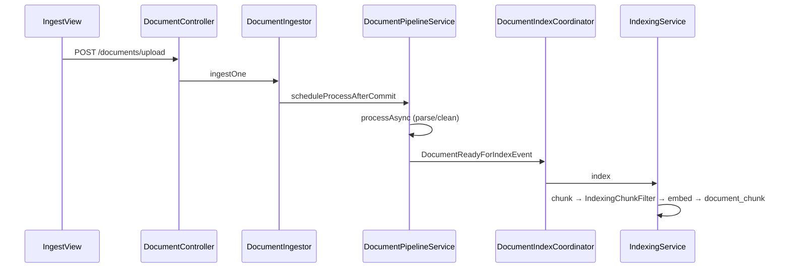
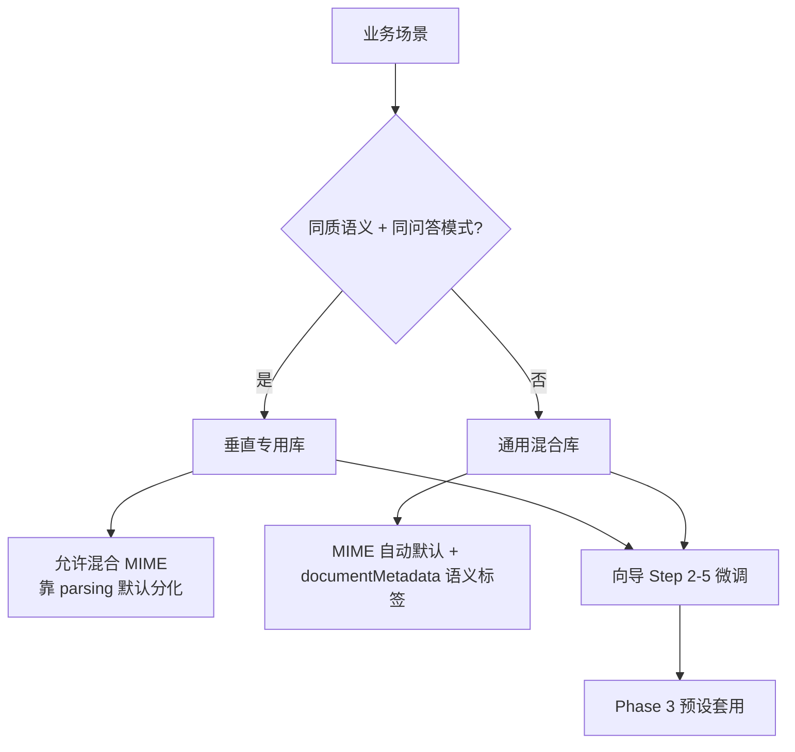

# Phase 1: 全链路流程梳理 - Pattern Map

**Mapped:** 2026-06-10
**Files analyzed:** 11 documentation sections / deliverables
**Analogs found:** 11 / 11

> Phase 1 交付物为**文档**，非代码。本图将各文档章节映射到最接近的**现有代码与规划文档 analog**，供 planner 在撰写 `INGEST-PIPELINE.md` 时直接引用路径、字段名与表格结构。

## File Classification

| New/Modified Deliverable | Role | Data Flow | Closest Analog | Match Quality |
|--------------------------|------|-----------|----------------|---------------|
| `.planning/docs/INGEST-PIPELINE.md`（主文档） | doc-root | narrative + cross-ref | `.planning/codebase/ARCHITECTURE.md` | exact |
| §1 范围与愿景（目标态 vs v1） | doc-section | narrative | `.planning/phases/01-ingest-pipeline/01-CONTEXT.md` `<domain>` | exact |
| §2 建库流程 PIPE-01 | doc-section | CRUD + config persist | `CreateLibraryWizard.vue` + `VectorLibraryController` + `LibraryConfigResolver` | exact |
| §3 入库全流程 PIPE-02（mermaid） | doc-section | async pipeline | `ARCHITECTURE.md` Data Flow + `DocumentIngestor` → `IndexingService` | exact |
| §4 阶段·类·API 对照 PIPE-03 | doc-section | request-response tables | `ARCHITECTURE.md` Entry Points + `frontend/knowbase-ui/src/api/*` | exact |
| §5 三层配置矩阵（系统/库/采集） | doc-section | config transform | `LibraryConfigResolver` + `libraryDefaults.js` + `libraryConfig.js` | exact |
| §6 库类型选型决策树 | doc-section | decision tree | `WIZARD_STEPS` + `01-CONTEXT.md` D-08–D-12 | role-match |
| §7 分块质量准则（通用） | doc-section | quality rubric | `IndexingChunkFilter` + `REQUIREMENTS.md` PIPE-02 | role-match |
| §8 反模式对照 + 样本 | doc-section | issue catalog | `.planning/codebase/CONCERNS.md` Tech Debt / Known Bugs | exact |
| 附录 A：当前差距 | doc-section | brownfield delta | `VectorLibraryConfigMerger` + `IngestView.vue` `overrideChunk` | exact |
| 附录 B：配置字段路径索引 | doc-section | field reference | `libraryConfig.js` `CONFIG_FIELD_SPECS` + `VectorLibraryConfig.java` | exact |

## Pattern Assignments

### `.planning/docs/INGEST-PIPELINE.md`（doc-root）

**Analog:** `.planning/codebase/ARCHITECTURE.md`

**Front matter pattern**（lines 1–8）:
```markdown
---
last_mapped_commit: <sha>
analysis_date: 2026-06-10
focus: ingest-pipeline
---

# 建库与入库全链路

**Analysis Date:** 2026-06-10
```

**System overview diagram**（lines 14–40）— 复制 ASCII/mermaid 双层结构：顶层组件框 + 数据流箭头；入库文档用 ingest 子图替代全系统：
```text
Frontend (IngestView / CreateLibraryWizard)
        │ HTTP /api/v1/*
        ▼
knowbase-service: library → ingest → vector → platform
        │
        ▼
PostgreSQL (doc_metadata, document_chunk) + Object Storage (raw/, parsed.txt)
```

**Component responsibility table**（lines 43–55）— 列：`Component | Responsibility | File`；Phase 1 至少 10 行（建库、上传、解析、索引、配置解析、预览、chunk 过滤、metadata 构建、协调器、前端入口）。

**Section naming convention**（from `ARCHITECTURE.md` + `STRUCTURE.md`）:
| 层级 | 命名 | 示例 |
|------|------|------|
| H2 | 英文概念 + 中文副标题可选 | `## Data Flow` / `## 建库流程` |
| H3 | 流程名或子域 | `### Document Ingest Pipeline` |
| 编号列表 | 阶段序号 + 类名反引号 | `1. Client uploads → \`DocumentController.upload\`` |
| 表格 | PascalCase 列头 | `Component`, `File`, `Base Path` |
| 附录 | `附录 {A\|B}: {主题}` | `附录 A: 当前差距` |

**Cross-link pattern** — 每章末链到代码路径（与 `01-CONTEXT.md` canonical_refs 一致）：
```markdown
### 代码锚点
- `knowbase-service/.../LibraryConfigResolver.java`
- `frontend/knowbase-ui/src/views/IngestView.vue`
```

---

### §2 建库流程 PIPE-01

**Analog:** `frontend/knowbase-ui/src/components/CreateLibraryWizard.vue` + `VectorLibraryController.java` + `libraryDefaults.js`

**Wizard step → config_json 映射**（`libraryDefaults.js` lines 11–17, 30–93）:
```javascript
export const WIZARD_STEPS = [
  { title: '基础信息' },           // name, description, tags
  { title: '数据类型与容量' },     // ingestAccess.supportedFileTypes, capacityLimits, versionPolicy
  { title: '文档处理规则' },       // parsing, cleaning, textNormalization, chunking*
  { title: '索引与检索' },         // embedding*, retrieval.*
  { title: '治理与安全' }          // governance.*
]
```

**默认配置形状**（`defaultLibraryConfig` — 文档 CONFIG 矩阵「库默认」列的种子）:
```javascript
{
  configVersion: 1,
  embeddingProvider: 'ollama',
  embeddingModel: 'nomic-embed-text',
  embeddingDimension: 768,
  chunkingStrategy: 'paragraph-first',
  chunkSize: 500,
  parsing: { ocrEnabled: false, tableExtraction: 'text-only', ... },
  cleaning: { removeHeaderFooter: true, removeDuplicateParagraphs: true, ... },
  retrieval: { hybridSearchEnabled: true, rerankEnabled: true, metadataFilterFields: [], ... },
  ingestAccess: { supportedFileTypes: ['pdf','word','txt','markdown','excel'], capacityLimits: {...} }
}
```

**API 建库链路**（`VectorLibraryController.java` lines 64–68）:
```java
@PostMapping
@ResponseStatus(HttpStatus.CREATED)
public VectorLibraryResponse create(@Valid @RequestBody CreateVectorLibraryRequest request) {
    return libraryService.create(request);
}
```

**配置生效路径**（`LibraryConfigResolver.java` lines 72–82, 99–116, 151–208）— 文档须画：`config_json` → `config(libraryId)` → 各 `*For(libraryId)`:
```java
public VectorLibraryConfig config(UUID libraryId) {
    VectorLibraryConfig cfg = JsonSupport.parseLibraryConfig(lib.getConfigJson());
    // 全局兜底：allowedMimeTypes, textNormalization
    return cfg;
}
public ChunkingProperties chunkingFor(UUID libraryId) { ... }
public ParsingRulesSettings parsingFor(UUID libraryId) { ... }
public EmbeddingSpec embeddingFor(UUID libraryId) { ... }
```

**前端 API 包装**（`frontend/knowbase-ui/src/api/library.js` lines 21–27）:
```javascript
export function createVectorLibrary(body) {
  return client.post('/api/v1/vector-libraries', body)
}
```

---

### §3 入库全流程 PIPE-02（mermaid + 阶段表）

**Analog:** `.planning/codebase/ARCHITECTURE.md` lines 114–131 + `DocumentIngestor.java` + `DocumentPipelineService.java` + `IndexingService.java`

**Mermaid 模板**（复制 ARCHITECTURE 风格，替换为 ingest 专用）:


**编号阶段表**（from ARCHITECTURE — 扩展为 PIPE-02 必填列）:

| # | 阶段 | 关键类 | 配置来源 (`LibraryConfigResolver`) | 持久化 |
|---|------|--------|-----------------------------------|--------|
| 1 | 上传校验 | `DocumentIngestor`, `UploadService` | `allowedMimeTypes`, `capacityLimitsFor`, `versionPolicyFor` | `doc_metadata`, MinIO `raw/` |
| 2 | 异步解析 | `DocumentPipelineService.processAsync` | `parseOptionsFor` ← `parsingFor` | `parsed.txt` |
| 3 | 文本规范化 | `ParsedTextNormalizer` | `normalizationFor` | — |
| 4 | 内容清洗 | `DocumentCleaningService` | `cleaningFor` | — |
| 5 | 索引触发 | `DocumentIndexCoordinator` | `requiresManualReview` → `index_requested` | `document_index_job` |
| 6 | 分块 | `ChunkingService` | `chunkingFor` | — |
| 7 | 表头过滤 | `IndexingChunkFilter` | — | — |
| 8 | 嵌入写入 | `LibraryEmbeddingService`, `DocumentChunkMapper` | `embeddingFor` | `document_chunk` |
| 9 | Chunk 元数据 | `ChunkMetadataBuilder` | `retrievalFor.retainChunkMetadata` | `document_chunk.metadata` |

**上传入口核心**（`DocumentIngestor.java` lines 60–110, 174–179）:
```java
@Transactional(propagation = Propagation.REQUIRES_NEW)
public DocumentResponse ingestOne(..., boolean autoIndex, String customMetadataJson) {
    validateMimeType(mimeType, fileName, libraryId);
    doc.setCustomMetadataJson(DocumentCustomMetadataSupport.normalizeJson(customMetadataJson));
    repository.save(doc);
    storeAndProcess(doc, bytes, fileName, mimeType);
}
// storeAndProcess → pipelineService.scheduleProcessAfterCommit(...)
```

**解析管道核心**（`DocumentPipelineService.java` lines 88–134）:
```java
String plainText = parseService.extractText(..., libraryConfigResolver.parseOptionsFor(doc.getLibraryId()));
plainText = textNormalizer.normalize(plainText, libraryConfigResolver.normalizationFor(...));
plainText = documentCleaningService.apply(plainText, libraryConfigResolver.cleaningFor(...));
// ... store parsed.txt ...
if (doc.isIndexRequested()) {
    indexCoordinator.processReadyForIndex(DocumentReadyForIndexEvent.create(...));
}
```

**索引管道核心**（`IndexingService.java` lines 149–212）:
```java
text = documentCleaningService.apply(text, libraryConfigResolver.cleaningFor(libraryId));
ChunkingProperties chunking = libraryConfigResolver.chunkingFor(libraryId);
List<String> chunks = chunkingService.chunk(libraryId, text, chunking);
chunks = IndexingChunkFilter.removeHeaderOnlyChunks(chunks);
List<float[]> embeddings = libraryEmbeddingService.embedBatch(libraryId, chunks);
chunkMapper.insertChunk(..., resolveChunkMetadataJson(libraryId, docId), embeddings.get(i));
```

---

### §4 阶段·类·API 对照 PIPE-03

**Analog:** `ARCHITECTURE.md` Entry Points table + `DocumentController.java` + `IndexAdminController.java` + `frontend/knowbase-ui/src/api/*.js`

**API endpoint table seed — 建库**:

| Method | Path | Controller | 前端模块 | UI 入口 |
|--------|------|------------|----------|---------|
| `GET` | `/api/v1/vector-libraries` | `VectorLibraryController.list` | `library.js` `listVectorLibraries` | `VectorLibrariesView` |
| `GET` | `/api/v1/vector-libraries/{libraryId}` | `VectorLibraryController.get` | `library.js` `getVectorLibrary` | `IngestView`, `EditLibrarySettingsDrawer` |
| `POST` | `/api/v1/vector-libraries` | `VectorLibraryController.create` | `library.js` `createVectorLibrary` | `CreateLibraryWizard` |
| `PUT` | `/api/v1/vector-libraries/{libraryId}` | `VectorLibraryController.updateSettings` | `library.js` `updateVectorLibrarySettings` | `EditLibrarySettingsDrawer` |

**API endpoint table seed — 采集/入库**:

| Method | Path | Controller | 前端模块 | UI 入口 | 说明 |
|--------|------|------------|----------|---------|------|
| `GET` | `/api/v1/documents/upload-constraints` | `DocumentController.uploadConstraints` | `ingest.js` `getUploadConstraints` | `IngestView` | 系统+库合并上限 |
| `POST` | `/api/v1/documents/parse-preview` | `DocumentController.parsePreview` | `ingest.js` `parsePreview` | `IngestView` | 仅解析，不入库 |
| `POST` | `/api/v1/index/chunk-preview` | `IndexAdminController.chunkPreview` | `chunk.js` | `IngestView`, `CreateLibraryWizard` | 分块预览，不入库 |
| `POST` | `/api/v1/documents/upload` | `DocumentController.upload` | `ingest.js` `uploadDocument` | `IngestView` | `documentMetadata` → `custom_metadata_json` |
| `POST` | `/api/v1/documents/upload/batch` | `DocumentController.uploadBatch` | `ingest.js` `uploadDocumentsBatch` | `IngestView` | 文件夹批量 |
| `POST` | `/api/v1/documents/{docId}/approve-index` | `DocumentController.approveIndex` | `ingest.js` `approveDocumentIndex` | — | `governance.ingestReviewMode=manual-review` |
| `GET` | `/api/v1/documents/{docId}/chunks` | `DocumentController.listChunks` | `ingest.js` `getDocumentChunks` | `DocumentChunksView` | 质量验收锚点 |
| `POST` | `/api/v1/index/rebuild-library` | `IndexAdminController.rebuildLibrary` | `vector.js` | — | 目标态软锁后的全库重索引 |

**预览双 API 分叉**（`IngestView.vue` lines 1149–1159）— PIPE-03 必须标注:
```javascript
const { data: parsed } = await parsePreview(file, libraryId.value)       // /documents/parse-preview
const { data: chunked } = await fetchChunkPreview(buildChunkPreviewBody(parsed.text || ''))  // /index/chunk-preview
```

---

### §5 三层配置矩阵

**Analog:** `LibraryConfigResolver.java` + `IngestProperties.java` + `libraryConfig.js` + `VectorLibraryConfig.java`

**矩阵表结构**（from `01-CONTEXT.md` D-07）:

| 规则项 | 配置路径 | 系统级 | 库默认 | 采集覆盖（目标态） | 现状 |
|--------|----------|--------|--------|-------------------|------|
| 单文件大小上限 | — | `IngestProperties.maxFileSize` | — | 禁止 | 系统固定 |
| 全局 MIME 白名单 | — | `IngestProperties.allowedMimeTypes` | `ingestAccess.supportedFileTypes` | 禁止 | 库可收窄 |
| OCR 引擎可用性 | `ingest.ocr.enabled` | 系统 | — | — | 无 tessdata 则失败 |
| Embedding 模型 | `embeddingModel` | `OllamaProperties` 兜底 | `config_json` | 目标态可覆盖+重索引 | 库级 |
| 分块策略 | `chunkingStrategy` | `ChunkingProperties` 默认 | `config_json` | 目标态 ingest profile | 库级；预览可 `overrideChunk` |
| 解析 OCR | `parsing.ocrEnabled` | — | `config_json` | 目标态 | 库级 |
| 语义标签 | `documentMetadata` 参数 | — | — | 写入 `custom_metadata_json` | 仅检索过滤，不驱动管道 |

**系统级字段**（`IngestProperties.java`）:
```java
private List<String> allowedMimeTypes = List.of(...);
private DataSize maxFileSize = DataSize.ofMegabytes(50);
public int getMaxBatchFiles() { ... }
```

**库级模型顶层**（`VectorLibraryConfig.java` lines 12–42）:
```java
private String embeddingProvider = "ollama";
private ChunkingStrategy chunkingStrategy = ChunkingStrategy.PARAGRAPH_FIRST;
private ParsingRulesSettings parsing = new ParsingRulesSettings();
private CleaningRulesSettings cleaning = new CleaningRulesSettings();
private RetrievalRulesSettings retrieval = new RetrievalRulesSettings();
private IngestAccessSettings ingestAccess = new IngestAccessSettings();
```

**字段路径命名权威来源**（`libraryConfig.js` lines 35–53, 161–173）— 文档 CONFIG 矩阵行键与此对齐:
```javascript
const REINDEX_FIELDS = new Set([
  'textNormalizationEnabled', 'chunkingStrategy', 'chunkSize', 'chunkOverlap',
  'parsing.ocrEnabled', 'parsing.tableExtraction', 'cleaning.removeDuplicateParagraphs', ...
])
const CONFIG_FIELD_SPECS = [
  { key: 'chunkingStrategy', label: '分块策略' },
  { key: 'embeddingModel', label: 'Embedding 模型' },
  ...
]
// 嵌套路径示例：parsing.ocrEnabled, ingestAccess.capacityLimits.maxDocuments
```

**Resolver 方法 → 管道阶段**（文档必列表）:

| Resolver 方法 | 消费方 | 对应配置路径 |
|---------------|--------|--------------|
| `allowedMimeTypes` | `DocumentIngestor.validateMimeType` | `ingestAccess.supportedFileTypes` |
| `capacityLimitsFor` | `LibraryCapacityValidator` | `ingestAccess.capacityLimits.*` |
| `parseOptionsFor` | `DocumentPipelineService` | `parsing.*` |
| `normalizationFor` | `DocumentPipelineService` | `textNormalization.*` |
| `cleaningFor` | `DocumentPipelineService`, `IndexingService` | `cleaning.*` |
| `chunkingFor` | `IndexingService`, `ChunkPreviewService` | `chunkingStrategy`, `chunkSize`, ... |
| `embeddingFor` | `LibraryEmbeddingService` | `embeddingProvider/Model/Dimension` |
| `retrievalFor` | `ChunkMetadataBuilder` via `IndexingService` | `retrieval.retainChunkMetadata`, `metadataFilterFields` |
| `requiresManualReview` | `DocumentIngestor.resolveIndexRequested` | `governance.ingestReviewMode` |

---

### §6 库类型选型决策树

**Analog:** `01-CONTEXT.md` D-08–D-12 + `CreateLibraryWizard.vue` `WIZARD_STEPS` / `STEP_DESCRIPTIONS`

**决策树 mermaid 种子**:


**启发式清单**（from CONTEXT D-10, D-11）— 用 CONCERNS 式条目写:
- 同质语义混合类型：周报 xlsx + 周报 pdf 导出 → **同垂直库**
- 异质语义同扩展名：周报 xlsx vs 报销 xlsx → **拆库**
- 不以扩展名为唯一建库依据；语义主轴 + MIME 感知默认

---

### §7 分块质量准则（通用）

**Analog:** `IndexingChunkFilter.java` + `REQUIREMENTS.md` PIPE-02 + `ChunkMetadataBuilder.java`

**v1 验收层表述**（from CONTEXT D-16）:
- 北极星：RAG 可答率（文档声明，非 v1 工程验收）
- v1 准则：检索可召回 — 块自洽、非纯表头、关键事实不无故跨块断裂、预览=入库（目标态）

**过滤规则摘录**（`IndexingChunkFilter.java` lines 6–23）:
```java
/** 入库前过滤低价值分块，减少表头块进入向量索引。 */
public static List<String> removeHeaderOnlyChunks(List<String> chunks) {
    // 若全部被判定为表头，保留原列表，避免文档完全无向量
    return kept.isEmpty() ? List.copyOf(chunks) : kept;
}
```

**Chunk 元数据样例字段**（`ChunkMetadataBuilder.java` lines 21–28）:
```java
putIfPresent(metadata, "mimeType", doc.getMimeType());
putIfPresent(metadata, "fileName", doc.getFileName());
putIfPresent(metadata, "docType", resolveDocType(...));
mergeCustomMetadata(metadata, doc.getCustomMetadataJson());  // semanticType=weekly-report 等
```

**Phase 2 引用** — 不写类型细表，链到 `FILE-TYPE-PROCESSING.md`（ROADMAP Phase 2）。

---

### §8 反模式对照 + 样本

**Analog:** `.planning/codebase/CONCERNS.md` Tech Debt / Known Bugs 条目格式

**反模式表结构**（复制 CONCERNS 四列 + 运营可读「错误设定」列）:

| 反模式 | 错误设定/行为 | 症状 | 代码锚点 | 正确做法 |
|--------|--------------|------|----------|----------|
| 预览≠入库 | `overrideChunkEnabled` 开启 | 运营见 N 块，入库 M 块 | `IngestView.vue:1132`, `IndexingService` 无 override | 目标态 PARITY；现状记入附录 A |
| 周报 xlsx 表头块 | `paragraph-first` + 无过滤认知 | 检索命中表头 | `IndexingChunkFilter`, 杜鹏飞周报样本 | `text-only` + 确认 4 chunk 全召回 |
| 扫描 PDF 空文本 | `parsing.ocrEnabled=false` | 0 chunk 或乱码 | `DocumentParseService`, CONCERNS OCR | 开启 OCR + tessdata |
| 异质语义混库 | 周报+报销同库 | 检索噪声 | CONTEXT D-10 | 按语义拆库 |

**CONCERNS 条目模板**（lines 11–16）:
```markdown
**{标题}:**
- Issue: ...
- Files: `path/to/File.java`, ...
- Why: ...
- Impact: ...
- Fix approach: ...
```

---

### 附录 A：当前差距

**Analog:** `VectorLibraryConfigMerger.java` + `VectorLibraryService.java` + `IngestView.vue` + `EditLibrarySettingsDrawer.vue`

**四类锚点**（from CONTEXT Claude's Discretion）:

| 锚点 | 现状 | 目标态 | 代码证据 |
|------|------|--------|----------|
| `DocumentPipelineService` | 库级 `parsing/cleaning` 整条管道 | 采集级可覆盖 | 仅 `libraryConfigResolver.*For(libraryId)` |
| `IndexingService` | 无 `overrideChunk` | 预览参数=入库参数 | `chunkingFor(libraryId)` 单一来源 |
| `IngestView.vue` | `overrideChunk` 仅预览 | 预览=入库 | lines 517–531, 1132 |
| `VectorLibraryConfigMerger` | `lockPipeline` **硬锁** | **软锁** + 全库重索引 | lines 67–71 |

**硬锁逻辑**（`VectorLibraryConfigMerger.java` lines 29–71）:
```java
/**
 * @param lockPipelineConfig true 时锁定解析/清洗/分块/向量化等影响已入库文档的字段
 */
if (lockPipelineConfig) {
    return;  // 仅合并 tags, retrieval, governance, ingestAccess
}
```

**触发条件**（`VectorLibraryService.java` lines 163–166）:
```java
boolean lockPipeline = documentCount > 0 || chunkCount > 0;
VectorLibraryConfigMerger.mergeSafeFields(existing, request.config(), lockPipeline);
```

**前端 lockPipeline UI**（`EditLibrarySettingsDrawer.vue` lines 443–446, `libraryConfig.js` lines 406–412）:
```javascript
const lockPipeline = computed(() => hasIngestedContent({
  documentCount: loadedDocCount.value,
  chunkCount: loadedChunkCount.value
}))
export function hasIngestedContent(libraryOrCounts) {
  return doc > 0 || chunk > 0
}
```

---

### 附录 B：配置字段路径索引

**Analog:** `libraryConfig.js` + `VectorLibraryConfig.java` + `defaultLibraryConfig()`

**完整路径种子表**（文档可直接展开为索引附录）:

| 路径 | 中文标签 | 影响重索引 | Wizard 步骤 |
|------|----------|------------|-------------|
| `embeddingProvider` | Embedding 提供方 | 是 | 4 |
| `embeddingModel` | Embedding 模型 | 是 | 4 |
| `embeddingDimension` | 向量维度 | 是 | 4 |
| `chunkingStrategy` | 分块策略 | 是 | 3 |
| `chunkSize` | 块大小 | 是 | 3 |
| `chunkOverlap` | 块重叠 | 是 | 3 |
| `minChunkSize` | 最小块 | 是 | 3 |
| `maxChunkSize` | 最大块 | 是 | 3 |
| `minParagraphLength` | 最短段落 | 是 | 3 |
| `normalizeBeforeChunk` | 分块前规范化 | 是 | 3 |
| `textNormalizationEnabled` | 文本清洗 | 是 | 3 |
| `textNormalization.*` | 清洗子规则 | 是 | 3 |
| `parsing.ocrEnabled` | OCR | 是 | 3 |
| `parsing.tableExtraction` | 表格提取 | 是 | 3 |
| `parsing.imageExtraction` | 图片提取 | 是 | 3 |
| `parsing.formulaExtraction` | 公式提取 | 是 | 3 |
| `parsing.defaultLanguage` | 默认语言 | 是 | 3 |
| `parsing.autoDetectEncoding` | 自动识别编码 | 是 | 3 |
| `cleaning.removeHeaderFooter` | 去页眉页脚 | 是 | 3 |
| `cleaning.removeDuplicateParagraphs` | 去重复段落 | 是 | 3 |
| `ingestAccess.supportedFileTypes` | 数据类型 | 否 | 2 |
| `ingestAccess.capacityLimits.maxDocuments` | 容量-文档数 | 否 | 2 |
| `ingestAccess.capacityLimits.maxTotalSizeBytes` | 容量-总大小 | 否 | 2 |
| `ingestAccess.capacityLimits.maxChunkEntries` | 容量-向量条目 | 否 | 2 |
| `ingestAccess.versionPolicy.*` | 版本策略 | 否 | 2 |
| `retrieval.hybridSearchEnabled` | 混合检索 | 否 | 4 |
| `retrieval.rerankEnabled` | 重排序 | 否 | 4 |
| `retrieval.metadataFilterFields` | 过滤字段白名单 | 否 | 4 |
| `governance.ingestReviewMode` | 入库审核 | 否 | 5 |
| `documentMetadata`（采集参数） | 语义标签 | 否 | IngestView |

---

## Shared Patterns

### 规划文档 YAML front matter
**Source:** `.planning/codebase/ARCHITECTURE.md`, `STRUCTURE.md`
**Apply to:** 所有 `.planning/docs/*.md`
```markdown
---
last_mapped_commit: <git sha when doc written>
analysis_date: YYYY-MM-DD
focus: <topic>
---
```

### 组件/职责表格
**Source:** `ARCHITECTURE.md` lines 43–55
**Apply to:** PIPE-03、配置矩阵、反模式表
```markdown
| Component | Responsibility | File |
|-----------|----------------|------|
```

### 编号数据流
**Source:** `ARCHITECTURE.md` lines 116–131
**Apply to:** §3 入库流程、§2 建库生效路径
```markdown
1. Client uploads → `DocumentController.upload`
2. `UploadService` → `DocumentIngestor.ingestOne`
...
```

### 问题/catalog 条目
**Source:** `CONCERNS.md` Tech Debt 模板
**Apply to:** §8 反模式、附录 A 差距
```markdown
**{标题}:**
- Issue: ...
- Files: `...`
- Impact: ...
- Fix approach: ...（或「目标态：…」）
```

### 需求可追溯
**Source:** `REQUIREMENTS.md` traceability table
**Apply to:** 主文档开头或末尾
```markdown
| Requirement | Section | Status |
| PIPE-01 | §2 建库流程 | Covered |
| PIPE-02 | §3 入库流程 | Covered |
| PIPE-03 | §4 API 对照 | Covered |
```

### 字段路径命名
**Source:** `libraryConfig.js` `diffLibraryConfig` / `REINDEX_FIELDS`
**Apply to:** §5 配置矩阵、附录 B — **统一 dot-path**，与前端 diff 一致，避免文档与 UI 两套命名。

---

## No Analog Found

| Deliverable | Role | Reason |
|-------------|------|--------|
| MIME 自动默认引擎（目标态描述） | doc-section | 无实现；文档引用 CONTEXT D-09 + Phase 2/3 backlog |
| 采集级 ingest profile 持久化 | doc-section | v1 不实现（D-06）；仅目标态叙述 |
| `CONFIG-TIERS.md` 独立文件 | doc-split | 可选；无先例。建议内嵌 `INGEST-PIPELINE.md` §5，与 planner 裁量一致 |

---

## Metadata

**Analog search scope:** `.planning/codebase/`, `.planning/phases/01-ingest-pipeline/`, `knowbase-service/src/main/java/com/knowbase/{library,ingest,vector,platform}/`, `frontend/knowbase-ui/src/{views,components,utils,api}/`
**Files scanned:** 28
**Pattern extraction date:** 2026-06-10
