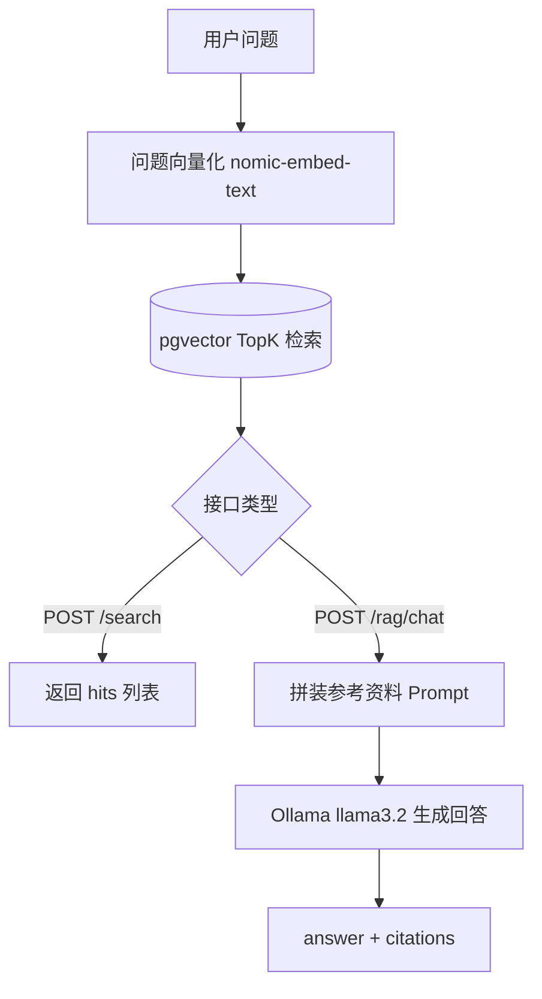
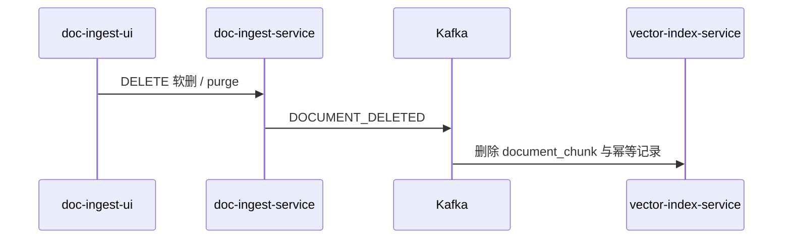

# doc-platform

Java 解耦文档平台：**文档采集入库**（`doc-ingest-service`）与 **向量索引检索**（`vector-index-service`）通过 Kafka 事件与共享契约 `doc-platform-contract` 协作。配套两个 Vue 3 控制台分别对接采集与检索 API。

默认工作目录：`D:\workspace\doc-platform`

---

## 技术栈

| 类别 | 选型 |
|------|------|
| 语言 / 运行时 | **JDK 21** |
| 应用框架 | **Spring Boot 3.2.4** |
| 持久化 | **MyBatis-Plus 3.5.7**（ingest / vector 各库 schema；向量检索 SQL 使用 MyBatis XML） |
| API 文档 | **Knife4j 4.4.0**（OpenAPI 3 / Jakarta） |
| 消息 | **Apache Kafka**（Topic：`doc.lifecycle.v1`） |
| 对象存储 | **MinIO**（原始文件 + Tika 解析文本） |
| 关系库 | **PostgreSQL 16 + pgvector** |
| 文本解析 | **Apache Tika** |
| 向量模型 | **Ollama `nomic-embed-text`**（768 维，纯文本 embedding） |
| 对话模型（RAG） | **Ollama `llama3.2`**（可配置 `ollama.chat-model`） |
| 前端 | **Vue 3 + Vite + Element Plus**（两个独立 SPA） |

---

## 模块与职责

| Maven 模块 | 端口 | 职责 |
|------------|------|------|
| `doc-platform-contract` | — | 生命周期事件 DTO、`KafkaTopics`、幂等键 `IdempotencyKeys` |
| `doc-ingest-service` | **8081** | 文件上传、URL 采集、Tika 解析、MinIO 读写、元数据 CRUD、发布/消费 Kafka 事件 |
| `vector-index-service` | **8082** | 离线索引流水线；在线语义检索与 **RAG 问答**（检索 + Prompt 增强 + LLM 生成） |
| `frontend/doc-ingest-ui` | **5173** | 文档管理、收集上传、状态查询 |
| `frontend/doc-vector-ui` | **5174** | RAG 问答、语义检索、补偿重索引、按 docId 清理向量 |

---

## 业务流程总览

平台分为 **离线阶段（Indexing）** 与 **在线推理阶段（Inference）**。离线负责把文档变成可检索的向量知识库；在线在用户提问时做检索，可选再走 RAG 生成自然语言回答。

| 阶段 | 触发方式 | 核心服务 | 产出 |
|------|----------|----------|------|
| **离线** | 上传/采集、`autoIndex`、Kafka 事件、补偿 rebuild | ingest + vector-index | MinIO 对象、解析文本、pgvector 向量块 |
| **在线** | 用户调用 `/search` 或 `/rag/chat` | vector-index | 相似片段列表，或带引用的生成式回答 |

### 离线阶段（Indexing Pipeline）

异步、事件驱动，不阻塞用户上传接口（解析可在提交后异步执行）。

```mermaid
flowchart LR
    subgraph ingest["doc-ingest-service"]
        A[上传 / URL 采集] --> B[MinIO 存原文]
        B --> C[doc_metadata 入库]
        C --> D[Tika 解析文本]
        D --> D2[ParsedTextNormalizer 规范化]
        D2 --> E[parsed_text_key 写 MinIO]
        E --> F[Kafka DOCUMENT_READY_FOR_INDEX]
    end
    subgraph vector["vector-index-service"]
        F --> G[消费事件 幂等]
        G --> H[读解析文本]
        H --> I[分块 chunking]
        I --> J[Ollama nomic-embed-text]
        J --> K[(pgvector document_chunk)]
        K --> L[Kafka DOCUMENT_INDEXED]
    end
    L --> M[ingest 回写 index_status]
```



**离线步骤说明**

1. **采集**：`POST /upload` 或 `POST /collect` 写入元数据与原始对象。
2. **解析**：Tika 提取纯文本 → **`ParsedTextNormalizer`**（换行统一、去控制字符、压空行、过滤页码等噪声行）→ 写入 MinIO（`parsed_text_key`）。
3. **发事件**：`DOCUMENT_READY_FOR_INDEX`（含 `docId`、`version`、`parsedTextKey` 等）。
4. **建索引**：vector 服务拉文本 → **`ChunkingService`**（默认 `paragraph-first`：先按空行段落切，过短合并、过长再按字符窗口+句读边界切）→ 批量 embedding → 写入 `vector_idx.document_chunk`。
5. **回执**：`DOCUMENT_INDEXED` → ingest 将 `index_status` 置为 `INDEXED`。
6. **删除/更新**：软删或 purge 发布 `DOCUMENT_DELETED`；重新上传升 `version` 后重复 3–5。

### 在线推理阶段（Inference）

同步 HTTP，依赖离线阶段已完成的向量库。



**在线步骤说明（RAG）**

1. **Retrieval**：将 `question` 向量化，在租户（及可选 docId 范围）内检索 TopK 片段，可按 `minScore` 过滤低相关命中。
2. **Augmentation**：将片段格式化为编号「参考资料」，与用户问题一并写入 user 消息；system 消息约束「仅依据资料作答」。
3. **Generation**：调用 Ollama `/api/chat`，返回 `answer` 与 `citations`（摘录、分数、docId、chunkIndex）。
4. **无命中**：不调用 LLM，直接返回提示文案（`usedLlm=false`）。

**仅检索（非 RAG）**：`POST /api/v1/search` 只执行步骤 1，返回原始片段，由调用方自行使用。

### 生命周期与删除（跨阶段）



**上传 vs URL 采集**

| 来源 | `source_type` | 去重规则 |
|------|---------------|----------|
|  multipart 上传 | `UPLOAD` | 同租户 `checksum_sha256` 未删除记录唯一 |
| URL 采集 | `CRAWL` | 同租户规范化后的 `source_url` 唯一（不同 URL 即使内容相同也视为不同文档） |

**删除语义**

- `DELETE /api/v1/documents/{docId}`：软删除（`deleted=true`），保留 MinIO 与元数据，发布 `DOCUMENT_DELETED` 清理向量。
- `DELETE /api/v1/documents/{docId}/purge`：物理删除元数据与 MinIO 对象，并发布 `DOCUMENT_DELETED`。

---

## 目录结构

```
doc-platform/
├── doc-platform-contract/     # 共享事件契约
├── doc-ingest-service/        # 采集服务
├── vector-index-service/      # 向量服务
├── frontend/
│   ├── doc-ingest-ui/
│   └── doc-vector-ui/
├── infra/postgres/            # init.sql、迁移与运维 SQL
├── scripts/                   # 构建、基础设施、启动、E2E（见 scripts/README.md）
├── docker-compose.yml         # Postgres / Kafka / MinIO / Ollama
├── build.cmd                  # 调用 scripts/build.ps1
└── pom.xml
```

---

## 基础设施与端口

| 组件 | 端口 | 默认账号 / 说明 |
|------|------|-----------------|
| PostgreSQL + pgvector | 5432 | `docplatform` / `docplatform`，库 `docplatform` |
| Kafka | 9092 | Topic 自动创建 |
| MinIO API / Console | 9000 / 9001 | `minioadmin` / `minioadmin`，桶 `documents` |
| Ollama | 11434 | 需拉取 **`nomic-embed-text`**（索引/检索）与 **`llama3.2`**（RAG 生成） |
| doc-ingest-service | 8081 | Knife4j：`/doc.html` |
| vector-index-service | 8082 | Knife4j：`/doc.html` |
| doc-ingest-ui | 5173 | 开发服务器 |
| doc-vector-ui | 5174 | 开发服务器 |

**数据库 Schema**

- `ingest`：`doc_metadata`（采集元数据）
- `vector_idx`：`processed_event`（幂等）、`document_chunk`（向量块）

---

## 部署方式

### 方式 A：Docker Compose（推荐本地联调）

```powershell
cd D:\workspace\doc-platform
.\scripts\start-infra.ps1
# 等价于 docker compose up -d，并拉取 nomic-embed-text + llama3.2
```

首次启动会执行 `infra/postgres/init.sql`。若数据库已存在且需 URL 去重字段，请手动执行一次 `infra/postgres/migrate-source-url.sql`。

### 方式 B：本机安装五件套

不使用 Docker 时，按 **`D:\document\安装教程\`** 安装：

1. PostgreSQL + pgvector → `D:\software\PostgreSQL`
2. Kafka → `D:\software\Kafka`
3. MinIO → `D:\software\MinIO`
4. Ollama → `D:\software\Ollama`（`ollama pull nomic-embed-text` 与 `ollama pull llama3.2`）
5. 联调步骤 → `05-doc-platform基础设施联调教程.md`

安装包下载（可选）：

```powershell
powershell -ExecutionPolicy Bypass -File D:\software\scripts\download-infra.ps1
```

初始化库表：执行 `infra/postgres/init.sql`。启动 Java 前运行：

```powershell
.\scripts\infra-check.ps1
```

---

## 构建与启动

### 构建

```powershell
cd D:\workspace\doc-platform
.\scripts\build.ps1          # clean package，默认跳过测试
.\scripts\build.ps1 -Test    # 含单元测试
# 或双击 build.cmd
```

Maven 默认路径：`D:\software\maven\apache-maven-3.9.11\bin\mvn.cmd`（可通过环境变量 `MAVEN_HOME` 覆盖）。

### 启动 Java 服务

```powershell
.\scripts\start-services.ps1
```

或分别开终端：

```powershell
java -jar doc-ingest-service\target\doc-ingest-service-1.0.0-SNAPSHOT.jar
java -jar vector-index-service\target\vector-index-service-1.0.0-SNAPSHOT.jar
```

### 启动前端

详见 [frontend/README.md](frontend/README.md)。

```powershell
cd frontend\doc-ingest-ui && npm install && npm run dev
cd frontend\doc-vector-ui && npm install && npm run dev
```

### 端到端冒烟

```powershell
.\scripts\e2e-test.ps1
```

---

## HTTP API

### doc-ingest-service（8081）— 前缀 `/api/v1/documents`

| 方法 | 路径 | 说明 |
|------|------|------|
| `POST` | `/upload` | multipart：`tenantId`、`file`、可选 `autoIndex`（默认 true） |
| `POST` | `/collect` | JSON：`tenantId`、`url`、可选 `autoIndex` |
| `GET` | `/` | 分页列表：`tenantId`、可选 `sourceType` / `parseStatus` / `indexStatus` / `keyword` |
| `GET` | `/{docId}` | 单条元数据 |
| `DELETE` | `/{docId}` | 软删除 |
| `DELETE` | `/{docId}/purge` | 物理删除 |

**允许上传 MIME**（`application.yml` → `ingest.allowed-mime-types`）：PDF、Word、Excel、纯文本/Markdown（含 `text/markdown`、`text/x-web-markdown` 等）、`.md` 扩展名兜底、常见图片等。

### vector-index-service（8082）

| 方法 | 路径 | 阶段 | 说明 |
|------|------|------|------|
| `POST` | `/api/v1/search` | 在线 | 语义检索：`tenantId`、`query`、`topK`、可选 `filter.docIds` |
| `POST` | `/api/v1/rag/chat` | 在线 | RAG 问答：`tenantId`、`question`、可选 `topK` / `minScore` / `filter` |
| `POST` | `/api/v1/index/rebuild` | 离线 | 按 docId 补偿重索引 |
| `DELETE` | `/api/v1/index/{docId}` | 离线 | 删除该文档向量数据 |

### Kafka 事件（Topic：`doc.lifecycle.v1`）

| 事件类型 | 生产者 | 消费者 |
|----------|--------|--------|
| `DOCUMENT_READY_FOR_INDEX` | ingest | vector-index |
| `DOCUMENT_INDEXED` | vector-index | ingest（回写 `index_status`） |
| `DOCUMENT_DELETED` | ingest | vector-index |

---

## 配置要点

- **ingest** 数据源：`jdbc:postgresql://localhost:5432/docplatform?currentSchema=ingest`
- **vector** 数据源：`currentSchema=vector_idx`，连接池 `SET search_path TO vector_idx, public`
- **MinIO**：两端均需能访问桶 `documents`；向量服务通过事件中的 `parsedTextKey` 直接读对象（非 presign 回调）
- **上传大小**：默认单文件 10MB（`spring.servlet.multipart`）
- **解析规范化**（ingest `ingest.text-normalization`）：`enabled`、`collapse-blank-lines`、`drop-noise-lines`、`line-patterns-to-drop` 等
- **分块规则**（vector `chunking`）：`strategy`（`paragraph-first` | `fixed-char`）、`chunk-size`、`overlap`、`min-chunk-size`、`max-chunk-size`、`min-paragraph-length`
- **RAG**：`ollama.chat-model`、`rag.system-prompt`、`rag.max-context-chars`；关闭 RAG 可设 `rag.enabled=false`

### 解析规范化与分块（离线）

| 环节 | 配置前缀 | 作用 |
|------|----------|------|
| Tika 抽取 | — | PDF/Office/图片等 → 纯文本 |
| 文本规范化 | `ingest.text-normalization` | 入库前清洗，提升分块与检索质量 |
| 向量分块 | `chunking` | 控制 chunk 粒度与边界策略 |

**已入库文档**：修改分块策略后需对文档执行 **补偿重索引**（`POST /api/v1/index/rebuild`）或重新上传升版本后才会按新规则重建向量。

---

## 运维脚本与 SQL

日常脚本说明见 **[scripts/README.md](scripts/README.md)**。

| SQL 文件 | 用途 |
|----------|------|
| `infra/postgres/init.sql` | 首次建库建表 |
| `infra/postgres/migrate-source-url.sql` | 旧库增加 `source_url` 与唯一索引 |
| `infra/postgres/reset-vector-idempotency.sql` | 索引反复失败时清空幂等表后重试 |

---

## API 调用示例

```powershell
# 上传
curl -X POST "http://localhost:8081/api/v1/documents/upload?tenantId=demo&autoIndex=true" `
  -F "file=@samples\knowledge.txt"

# URL 采集
curl -X POST "http://localhost:8081/api/v1/documents/collect" `
  -H "Content-Type: application/json" `
  -d '{"tenantId":"demo","url":"https://example.com/doc.html","autoIndex":true}'

# 列表
curl "http://localhost:8081/api/v1/documents?tenantId=demo&page=1&size=20"

# 语义检索（仅 Retrieval）
curl -X POST "http://localhost:8082/api/v1/search" `
  -H "Content-Type: application/json" `
  -d '{"tenantId":"demo","query":"向量数据库","topK":5}'

# RAG 问答（Retrieval + Generation）
curl -X POST "http://localhost:8082/api/v1/rag/chat" `
  -H "Content-Type: application/json" `
  -d '{"tenantId":"demo","question":"向量数据库在本项目中如何使用的？","topK":5}'
```

---

## 能力边界与后续扩展

- **RAG 与纯检索**：`/search` 只返回片段；`/rag/chat` 在命中片段后调用对话模型，需本地已安装 `llama3.2`（或修改配置为其他 Ollama 模型）。
- **nomic-embed-text** 仅对**文本**做 embedding；图片、表格等内容依赖 Tika 提取出的文字，无 OCR/多模态时扫描件可能检索效果有限。
- 重复上传同一文件（UPLOAD）会命中 checksum 去重；已 `INDEXED` 的文档重新上传会升版本并重新进入 `PENDING` 索引流水线。
- 向量索引失败且不再重试时，可执行 `reset-vector-idempotency.sql` 后触发 rebuild 或重新上传。
- 后续可扩展：流式 SSE 输出、重排序（Rerank）、多轮对话记忆、引用原文跳转等。

---

## 相关文档

- [frontend/README.md](frontend/README.md) — 前端页面与代理配置
- [scripts/README.md](scripts/README.md) — PowerShell 运维脚本
- Knife4j：http://localhost:8081/doc.html 、http://localhost:8082/doc.html
