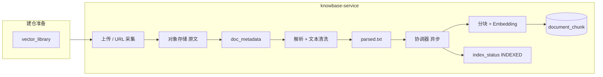

# 知库（knowbase）

企业知识库平台：**建仓入库**、**智能问答** 统一在 `knowbase-service`（端口 **8080**）；前端统一为 `knowbase-ui`（端口 **5173**）。

默认工作目录：仓库根目录（克隆路径可为 `doc-platform` 或 `knowbase`）

---

## 技术栈

| 类别 | 选型 |
|------|------|
| 语言 / 运行时 | **JDK 21** |
| 应用框架 | **Spring Boot 3.2.4**（单体） |
| 持久化 | **MyBatis-Plus 3.5.7**（PostgreSQL 单 schema `public`） |
| API 文档 | **Knife4j 4.4.0** |
| 对象存储 | **MinIO** 或 **本地文件系统**（`storage.type` 可配置） |
| 关系库 | **PostgreSQL 16 + pgvector** |
| 文本解析 | **Apache Tika** |
| Embedding | **Ollama `nomic-embed-text`** |
| RAG 对话 | **Ollama `llama3.2`** |
| 前端 | **Vue 3 + Vite + Element Plus**（`knowbase-ui`） |

**不再依赖**：Kafka、`doc-platform-contract` 独立模块。

---

## 模块结构

| 路径 | 说明 |
|------|------|
| `knowbase-api/` | 对外 Facade 接口、SPI、命令/结果 DTO |
| `knowbase-core/` | 领域服务、流水线、持久化（库 JAR） |
| `knowbase-autoconfigure/` | Spring Boot 自动配置（数据源、MyBatis、Flyway） |
| `knowbase-starter/` | 宿主 Maven 依赖入口 |
| `knowbase-app/` | 独立可执行应用（`java -jar`，端口 8080） |
| `frontend/knowbase-ui/` | 统一前端控制台 |
| `infra/postgres/` | 数据库初始化与迁移 SQL |
| `scripts/` | 构建、基础设施、启动、E2E |

包内衔接层：`com.knowbase.platform.DocumentIndexCoordinator`（替代原 Kafka 事件总线）。

---

## 功能分期

### 一期（已实现 · 当前基线）

知识库 = 规则容器，文档入库 = 固定流水线执行。

| 能力 | 说明 |
|------|------|
| 知识库四步向导 | 数据源 → 预处理（分块预览）→ 向量化；支持仅建库不入库 |
| 库级 `config_json` | 清洗、分块、Embedding、数据源模式 |
| 文档采集 | 手动上传 / URL 采集（按库数据源开关）；`autoIndex` 入库开关 |
| 采集页规则摘要 | 只读展示当前库规则；跳转编辑规则 |
| 编辑规则 Diff | 保存前变更对比；影响索引时引导批量补偿重索引 |
| 批量重索引 | `POST /api/v1/index/rebuild-library`（按 `parsedTextKey` 异步重建） |
| 入库流水线 | 接入 → Tika 解析 → 清洗 → 分块 → Embedding → `document_chunk` |
| RAG / 检索 | `POST /api/v1/search`、`/rag/chat`（按库 Embedding） |

设计原则（一期）：**创建时设定主规则，入库时按库规则执行**，入库侧仅保留少量操作开关。

### 二期（建设中 · 治理容器 + 五步向导）

> 创建知识库 → 文档入库 → 规则策略 → 流程与建设方案

- **知识库** = 长期稳定的「治理容器」（默认规则 + 治理边界 + `config_version` 快照）
- **文档入库** = 单次「加工流水线」（按库规则 + 少量可覆盖项 + 入库前预览确认）
- **文档采集**：固定同时支持「选择文件」与「选择文件夹」批量接入，无需在创建/配置向导中选择接入方式
- **创建向导**：快速创建（仅基础信息 + 默认规则）/ 高级配置（五步）
  1. 基础信息（名称、描述、标签）
  2. 数据类型与容量（支持类型、单库容量、版本策略；不含接入方式配置）
  3. 文档处理（解析 / 分块 / 清洗规则）
  4. 索引与检索（Embedding、混合检索、Rerank 等，部分预留）
  5. 治理与安全（审核、权限、保留、合规、审计）
- **创建产出**：知识库 ID + `config_version=1` + 空文档列表 + 可选示例文档
- **入库页**：库规则摘要、`config_version`、可覆盖 `autoIndex`/块大小、入库前预览确认；双入口（文件 / 文件夹）始终可用

二期配置中标注「预留」的项（OCR、混合检索、Rerank 等）已写入 `config_json`，流水线逐步对接。

---

## 业务流程总览

### 文档采集（离线 / 异步，按知识库）

前端侧栏：**知识库管理**、**智能问答**。**文档采集**、文档详情等从知识库详情进入，不在侧栏。

所有采集/检索/RAG 请求需携带 **`libraryId`**（默认库 `00000000-0000-0000-0000-000000000001`）。



1. **知识库**（API：`vector-libraries`）：`GET/POST /api/v1/vector-libraries`；`PUT /{libraryId}` 可更新名称、分块/清洗/检索/治理规则、**库级 Embedding**（`config_version` 递增）；`ingestAccess.accessMode` 固定为 `upload-and-folder`（不可配置）
2. **入库流水线**（代码固定）：数据源接入 → 解析 → 清洗 → 分块 → 向量化 → 入库
3. **采集**：`POST .../upload`、`/upload/batch`、`/upload/async`（文件与文件夹批量均走上传接口）
4. **解析**（异步）：Tika + `ingest.text-normalization`
5. **索引**（异步）：固定执行分块、向量化并写入 `document_chunk`（规范化/清洗由系统 `ingest.text-normalization` 与 MIME 代码规则控制）
6. **问答/检索**：`POST /api/v1/search`、`/rag/chat` 需 `libraryId`

### 智能问答（在线 / 实时）

前端菜单：**智能问答**（问答 + 检索片段调试）。

| 能力 | API |
|------|-----|
| RAG 问答 | `POST /api/v1/rag/chat`（可选 `chatModel` 覆盖全局对话模型） |
| 语义检索 | `POST /api/v1/search`（查询向量按库 Embedding 配置生成） |
| 批量重索引 | `POST /api/v1/index/rebuild-library`（文档库页触发） |

无命中时 RAG 返回以 **「未找到：」** 开头的固定文案，不调用 LLM，避免编造。

---

## 基础设施与端口

| 组件 | 端口 | 说明 |
|------|------|------|
| PostgreSQL + pgvector | 5432 | 库 `knowbase`，单 schema `public`（见 `infra/postgres/init.sql`） |
| MinIO | 9000 / 9001 | 桶 `documents` |
| Ollama | 11434 | `nomic-embed-text` + `llama3.2` |
| **knowbase-app** | **8010** | 知库 REST API；Knife4j：`/doc.html`（独立部署） |
| **knowbase-ui** | **5173** | 统一控制台（开发代理 `/api` → **8010**） |
| kanhai 宿主（可选） | 8080 | 业务系统；与知库 UI **分离**时无需暴露 `/api/v1/*` |

`docker-compose.yml` 仅包含 **Postgres、MinIO、Ollama**（已移除 Kafka）。

> **从 doc-platform 升级**：模块已重命名为 `knowbase-service` / `knowbase-ui`，Java 包为 `com.knowbase.*`，数据库账号/库名改为 `knowbase`。若本地仍使用旧库 `docplatform`，请执行 `.\scripts\reset-db.ps1 -RecreateContainer` 或手动迁移；前端请进入 `frontend\knowbase-ui` 开发（旧目录 `doc-platform-ui` 可删除）。

---

## 快速启动

```powershell
# 在仓库根目录执行
.\scripts\build.ps1
.\scripts\start-infra.ps1    # 或本机安装后 .\scripts\infra-check.ps1
.\scripts\start-services.ps1 # 启动 knowbase-app（8010）

cd frontend\knowbase-ui
npm install
npm run dev                  # http://localhost:5173 → API 代理到 8010
```

```powershell
java -jar knowbase-app\target\knowbase-app-1.0.0-SNAPSHOT.jar
```

---

## HTTP API（路径未变）

### 知识库

| 方法 | 路径 | 说明 |
|------|------|------|
| `GET` / `POST` | `/api/v1/vector-libraries` | 列表 / 新增知识库 |
| `GET` / `PUT` | `/api/v1/vector-libraries/{libraryId}` | 详情 / 更新预处理·分块·向量化配置 |
| `GET` | `/api/v1/upload-tasks/{taskId}` | 大文件异步入库任务状态 |

### 文档采集 — `/api/v1/documents`

| 方法 | 路径 | 说明 |
|------|------|------|
| `POST` | `/parse-preview` | 建仓向导：Tika 解析预览 |
| `GET` | `/upload-constraints?libraryId=` | 上传限制 |
| `POST` | `/upload?libraryId=` | 单文件上传 |
| `POST` | `/upload/async?libraryId=` | 大文件异步上传 |
| `POST` | `/upload/batch?libraryId=` | 批量上传 |
| `POST` | `/collect` | URL 采集（body 含 `libraryId`） |
| `GET` | `/?libraryId=` | 分页列表 |
| `GET` | `/{docId}` | 元数据 |
| `DELETE` | `/{docId}` | 软删除 |
| `DELETE` | `/{docId}/purge` | 物理删除 |

### 向量 / RAG — `/api/v1`

| 方法 | 路径 | 说明 |
|------|------|------|
| `POST` | `/search` | 语义检索（body 含 `libraryId`） |
| `POST` | `/rag/chat` | RAG 问答（body 含 `libraryId`） |
| `POST` | `/index/chunk-preview` | 分块规则预览 |
| `POST` | `/index/rebuild` | 单文档补偿重索引（body 含 `libraryId`） |
| `POST` | `/index/rebuild-library` | 按当前库规则批量补偿重索引 |
| `DELETE` | `/index/{docId}` | 清理向量 |

---

## 数据库（单 schema 重建）

全新环境：`docker compose` 首次启动会执行 `infra/postgres/init.sql`。

**一键重置（推荐，会清空全部业务数据）**：

```powershell
.\scripts\reset-db.ps1
```

重建 Postgres 容器（空库自动初始化）：

```powershell
.\scripts\reset-db.ps1 -RecreateContainer
```

**本机 PostgreSQL（从 docplatform 升级或需删旧库）**：

```powershell
.\scripts\reset-db.ps1 -UseLocalPsql -BootstrapLocal -AdminPassword "<postgres超级用户密码>" -SkipConfirm
```

手动执行 SQL 见 `infra/postgres/recreate-single-schema.sql` → `drop-public-tables.sql` → `init.sql`。

表：`vector_library`、`upload_task`、`doc_metadata`、`document_chunk`、`document_index_job`、`processed_event`、`chat_conversation`、`chat_message`（均在 `public`）。

Greenfield 安装仅使用 `init.sql`；全量重建可用 `infra/postgres/schema-v2-greenfield.sql`。

### 中文乱码排查（Windows 常见）

原因多为：**SQL 脚本按 GBK 写入库** 或 **JDBC/psql 客户端编码不是 UTF-8**。项目已统一为 UTF-8（`application.yml`、本机 `reset-db.ps1` 管道、`start-services.ps1` 的 `-Dfile.encoding=UTF-8`）。

1. 检查当前库编码与样本数据：

```powershell
.\scripts\check-db-encoding.ps1
# 本机 PostgreSQL：
.\scripts\check-db-encoding.ps1 -UseLocalPsql
```

2. **已乱码的数据无法自动修复**，需用 UTF-8 重新灌库：

```powershell
.\scripts\reset-db.ps1
# Docker 且希望空库重建：
.\scripts\reset-db.ps1 -RecreateContainer -SkipConfirm
```

3. 重新编译并启动后端（务必用 `.\scripts\start-services.ps1`，不要裸 `java -jar` 省略编码参数）。

## 配置要点

- 数据源：`jdbc:postgresql://localhost:5432/knowbase`，`search_path=public`
- `storage.type`：`minio`（默认）或 `local-fs`；`storage.path-prefix` / `storage.local.base-path`（**全局服务端配置**，不在创建向导或库规则页面设定）
- `ingest.max-file-size`、`ingest.max-batch-files`、`ingest.allowed-mime-types`
- `ingest.ocr.*`：Tesseract OCR 引擎（`enabled`、`data-path`、`language`）；库级 `parsing.ocrEnabled=true` 时对扫描 PDF 等启用回退
- `ingest.text-normalization.*`：解析后文本清洗（配置前缀，非 DB schema）
- `embedding.provider`：向量化实现（一期 `ollama`）
- `chunking.*`：分块策略（默认 `paragraph-first`）
- `rag.*` / `ollama.*`：RAG 与模型配置

---

## 解析规范化与分块

| 环节 | 配置 | 作用 |
|------|------|------|
| Tika 抽取 | — | 多格式 → 纯文本 |
| 文本规范化 | `ingest.text-normalization` | 入库前清洗 |
| 向量分块 | `chunking` | 段落优先 + 长度兜底 |

修改分块规则后需 **rebuild** 或重新上传升版本。

---

## 运维脚本

见 [scripts/README.md](scripts/README.md)、[scripts/github-sync.md](scripts/github-sync.md)。

```powershell
.\scripts\e2e-test.ps1   # 针对 localhost:8080
```

---

## 宿主集成（Spring Boot Starter）

Java 宿主（如 kanhai）通过 Maven 依赖嵌入知库，**无需 HTTP 侧车**：

```xml
<dependency>
    <groupId>com.knowbase</groupId>
    <artifactId>knowbase-starter</artifactId>
    <version>1.0.0-SNAPSHOT</version>
</dependency>
```

```yaml
# 宿主 application.yml
knowbase:
  enabled: true
  web:
    # 嵌入 knowbase-ui 控制台时必须 true，否则 /api/v1/vector-libraries 无路由
    expose-controllers: true
  datasource:
    url: jdbc:postgresql://localhost:5432/knowbase
    username: knowbase
    password: knowbase
  flyway:
    enabled: true               # 空库时启用；Docker init.sql 已建表可 false

spring:
  datasource:
    url: jdbc:postgresql://localhost:5432/kanhai   # 宿主业务库
```

知库使用独立 `knowbaseDataSource` + `knowbaseSqlSessionFactory`，与宿主 MyBatis-Plus **可共存**（宿主 `@MapperScan` 仅扫描自身包即可）。

宿主实现 `KnowbaseTenantResolver`（从 JWT 取 `orgId`），注入后调用 Facade：

- `KnowbaseRagFacade` / `KnowbaseSearchFacade` / `KnowbaseIngestFacade` / `KnowbaseLibraryFacade`

**Kanhai 完整业务层示例**（Controller + Service + 组织库绑定 + JWT 租户）见
[`examples/kanhai-integration/`](examples/kanhai-integration/README.md)，复制 `org.shkj.kanhai.knowbase` 包即可。

- **仅 Facade 调用**（`/api/knowledge/*`）：`expose-controllers: false`，宿主自行封装 API
- **挂载 knowbase-ui 控制台（方案 A）**：`expose-controllers: true`，前端直连宿主 `/api/v1/*`
- **与宿主分离（方案 B，推荐）**：kanhai 保持 `expose-controllers: false`；`knowbase-ui` 代理到 **knowbase-app :8010**（见 `frontend/knowbase-ui/.env`）

独立部署使用 `knowbase-app` 可执行 JAR（`knowbase.web.expose-controllers: true`，端口 **8010**）。

---

## 相关文档

- [frontend/README.md](frontend/README.md)
- Knife4j：http://localhost:8010/doc.html
