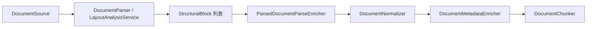

# 内置深度解析架构与能力地图

本文描述 KnowBase **内置解析器**（非 Docling/Unstructured 外接）的目标架构、已实现能力与相对主流通用文档解析（RAGFlow、Unstructured、MinerU、PaddleOCR-VL pipeline）的差距。

## 1. 核心概念（建议统一术语）

| 概念 | 含义 | 当前载体 |
|------|------|----------|
| **DocumentParser** | 按 MIME/扩展名将字节流变为 `ParsedDocument` | `pdf-layout`、`html-structure`、`table-deep` 等 |
| **StructuralBlock** | 结构块：heading / paragraph / table_row / list_item … | `knowbase-ingestion` |
| **Parse Enricher 链** | 解析后统一增强：页尺寸、bbox 提示、OCR 置信度、表区 ID、TableGrid、阅读顺序、表摘要 | `ParsedDocumentParseEnricher` |
| **LayoutAnalysisService** | 光栅页统一版面分析 SPI（PaddleOCR-VL / VLM markdown / OCR raster） | `knowbase-ingestion/layout/` |
| **TableGridModel** | table → row → cell 三层逻辑网格 | `TableGridModel` + `TableGridParseEnricher` |
| **DocumentProfile (L2)** | 按文件类型路由 parser + chunking + OCR/layout 选项 | `knowbase-preset` |
| **Vision-Language Model** | 复杂/扫描 PDF 的 VLM 逐页解析 | `knowbase.vision-document`（官方 PaddleOCR-VL / vLLM） |
| **OcrEngineAdapter** | Tesseract / Paddle HTTP 等 OCR 引擎 SPI | `OcrEngineRegistry` |
| **Evidence Asset Hint** | 引用预览线索：页码、bbox、sheet 行、表区 | `EvidenceAssetHintEnricher` |
| **tableRegionId** | 表格逻辑区域，用于 summary、citation、续表 | PDF/Excel/HTML/Markdown/OCR 路径 |

## 2. 解析流水线（内置）



**Parse Enricher 链（当前顺序）**

1. `StructuralBlockIndexabilityPolicy` — 可索引提示
2. `ParsePageDimensionEnricher` — 页宽/高
3. `EvidenceAssetHintEnricher` — 引用线索
4. `OcrParseEnricher` — OCR 低置信度策略（filter / downweight / review）
5. `OcrHierarchyEnricher` — paragraph → line → word 层级
6. `OcrLanguageEnricher` — 语言传播
7. `TableRegionIdParseEnricher` — 孤立 table_row 补 region
8. `TableGridParseEnricher` — table/row/cell 三层 `tableGrid`
9. `TableRegionSummaryParseEnricher` — 表区摘要块
10. `ReadingOrderParseEnricher` — 阅读顺序（bbox 启发式 + HTTP 扩展点）
11. `UniversalParseConfidenceAggregator` — 文档级置信度

## 3. 格式覆盖与深度（内置）

| 格式 | 主 Parser | 深度能力 | 与主流差距 |
|------|-----------|----------|------------|
| PDF 电子版 | `pdf-layout` | 多栏、TextPosition bbox、列对齐表、续表、TableGrid | 复杂网格/嵌套表、公式 |
| PDF 扫描件 | `pdf-layout` → LayoutAnalysisService | PaddleOCR-VL `prunedResult` bbox + markdown 回退 | 专用 reading-order 模型 |
| Markdown | `markdown-structure` | 标题/列表/代码块/GFM 管道表 | 合并单元格、嵌套表 |
| HTML | `html-structure` | Jsoup 标题/列表/顶层表、colspan/rowspan | 嵌套表独立区域、CSS 浮动 |
| Word | `docx-structure` | 标题/列表/表、gridSpan/vMerge | 文本框、浮动表、页眉页脚 |
| Excel/CSV | `table-deep` | 三阶段自适应、多级表头、公式 | 跨 sheet 引用（部分已有） |
| 代码/配置 | `code-config-structure` | YAML/JSON/Properties 分段 | JSON Schema 语义 |
| 图片 | `ocr-layout` | hOCR/TSV/JSON、词级 bbox | Paddle 生产默认可用性 |
| PPT | `pptx-structure` | 幻灯片标题/正文/表格、`slideNumber`、表区 | 旧 `.ppt` 仍 Tika；形状层级/备注页 |

## 4. 仍缺的重要组件（建议路线图）

### 4.1 解析层

- **`ReadingOrderModel`**：跨页、跨栏全局序号（现多为页内 ordinal / bbox 启发式）
- **`FormulaBlock` 类型**：PDF/Word 公式保留 LaTeX/MathML
- **本地 ONNX layout provider**：`LayoutAnalysisProvider` 扩展位已预留

### 4.2 资产与引用

- **`EvidenceArtifactGenerator`**：页截图、表区裁剪图写入 ObjectStorage（现仅有 URI hint）
- **Citation 闭环**：后端 metadata 已就绪；前端 PDF.js bbox overlay 已接入文档详情页

### 4.3 质量与运维

- **`sample-documents` 金标集**：每类 ≥3 文档 + chunk 快照（部分已有，见 `scripts/run-ingestion-eval.ps1`）
- **ingestion eval 脚本**：离线 parse/chunk 回归 + 在线 `verify-sample-documents.ps1`
- **Parser 健康探针**：Ollama VLM / Tesseract / Paddle endpoint 启动检查

### 4.4 配置与产品

- **Profile 级 parser 选项**：`ocrEngine`、`layoutProvider`、`ocrDownweightMode` 已可通过 `DocumentProfile.options` 覆盖
- **`default_scanned_document`**：可改为 `pdf-layout` + VLM/OCR 路由，而非仅 `ocr-layout`

## 5. 配置速查

```yaml
knowbase:
  vision-document:
    enabled: true
    provider: paddleocr-vl   # 或 vllm / ollama
    paddleocr-vl:
      base-url: http://localhost:8080
    vllm:
      base-url: http://localhost:8118
      model: PaddleOCR-VL-1.6-0.9B
  ollama:
    vision-language-model: ""  # 官方服务启用时留空
  ingestion:
    pdf:
      vl-on-scanned: true
      vl-on-low-confidence: true
      vl-fallback-to-heuristic: true
    ocr:
      default-engine: tesseract
      language: auto
      confidence-threshold: 0.6
      downweight-mode: downweight   # filter | downweight | review
```

Docker 本地部署见 [PADDLEOCR_VL_DEPLOYMENT.md](./PADDLEOCR_VL_DEPLOYMENT.md)。

文档级覆盖：`pdfParseMode=vl|ocr|layout`、`ocrEngine=tesseract|paddle`、`layoutProvider=paddleocr-vl`、`ocrDownweightMode=review`。

## 6. 相关文档

- [PHASE2_INGESTION_PLAN.md](./PHASE2_INGESTION_PLAN.md) — 二期交付与缺项
- [INGESTION_INTERFACES.md](./INGESTION_INTERFACES.md) — SPI 说明
- [EXCEL_ADAPTIVE_PARSE.md](./EXCEL_ADAPTIVE_PARSE.md) — 表格自适应

## 7. 评测脚本

```powershell
# 离线 parse + chunk 回归
.\scripts\run-ingestion-eval.ps1

# 解析专项回归
.\scripts\run-parse-regression.ps1
```
