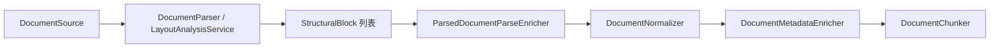

# 内置深度解析架构与能力地图

本文描述 KnowBase **内置解析器**（非 Docling/Unstructured 外接）的目标架构、已实现能力与相对主流通用文档解析（RAGFlow、Unstructured、MinerU、PaddleOCR-VL pipeline）的差距。

## 1. 核心概念（建议统一术语）

| 概念 | 含义 | 当前载体 |
|------|------|----------|
| **DocumentParser** | 按 MIME/扩展名将字节流变为 `ParsedDocument` | `pdf-layout`、`html-structure`、`table-deep` 等 |
| **StructuralBlock** | 结构块：heading / paragraph / table_row / list_item … | `knowbase-ingestion` |
| **Parse Enricher 链** | 解析后统一增强：页尺寸、bbox 提示、OCR 置信度、表区 ID、TableGrid、阅读顺序、表摘要 | `ParsedDocumentParseEnricher` |
| **LayoutAnalysisService** | 光栅页统一版面分析 SPI（PaddleOCR-VL / VLM markdown / OCR raster / **local-pdf-layout**） | `knowbase-ingestion/layout/` |
| **TableGridModel** | table → row → cell 三层逻辑网格 | `TableGridModel` + `TableGridParseEnricher` |
| **DocumentProfile (L2)** | 按文件类型路由 parser + chunking + OCR/layout 选项 | `knowbase-preset` |
| **Vision-Language Model** | 复杂/扫描 PDF 的 VLM 逐页解析 | `knowbase.vision-document`（官方 PaddleOCR-VL / vLLM） |
| **OcrEngineAdapter** | Tesseract / Paddle HTTP 等 OCR 引擎 SPI | `OcrEngineRegistry` |
| **Evidence Asset Hint** | 引用预览线索：页码、bbox、sheet 行、表区 | `EvidenceAssetHintEnricher` |
| **tableRegionId** | 表格逻辑区域，用于 summary、citation、续表 | PDF/Excel/HTML/Markdown/OCR 路径 |

## 2. 解析流水线（内置）



**Parse Enricher 链（当前顺序）**

1. `StructuralBlockIndexabilityPolicy` — 可索引提示
2. `ParsePageDimensionEnricher` — 页宽/高
3. `EvidenceAssetHintEnricher` — 引用线索
4. `OcrParseEnricher` — OCR 低置信度策略（filter / downweight / review）
5. `OcrHierarchyEnricher` — paragraph → line → word 层级
6. `OcrLanguageEnricher` — 语言传播
7. `TableRegionIdParseEnricher` — 孤立 table_row 补 region
8. `TableGridParseEnricher` — table/row/cell 三层 `tableGrid`
9. `TableSemanticParseEnricher` — 合并单元格摘要（hasMergedCells、maxColumnSpan/RowSpan、tableSemanticVersion）
10. `TableRegionSummaryParseEnricher` — 表区摘要块
11. `FormulaBlockParseEnricher` — LaTeX 启发式 → `formula` 块（formulaLatex/Format/Display）
12. `ReadingOrderParseEnricher` — 阅读顺序（bbox 启发式 + HTTP 扩展点）
13. `UniversalParseConfidenceAggregator` — 文档级置信度

## 3. 格式覆盖与深度（内置）

| 格式 | 主 Parser | 深度能力 | 与主流差距 |
|------|-----------|----------|------------|
| PDF 电子版 | `pdf-layout` | 多栏、TextPosition bbox、列对齐表、续表、TableGrid、公式块、cell columnSpan | 复杂 ruled 网格、Word 公式 |
| PDF 扫描件 | `pdf-layout` → LayoutAnalysisService | PaddleOCR-VL `prunedResult` bbox + markdown 回退 | 跨页专用 reading-order 模型 |
| Markdown | `markdown-structure` | 标题/列表/代码块/GFM 管道表 | 合并单元格、嵌套表 |
| HTML | `html-structure` | Jsoup 标题/列表/顶层表、colspan/rowspan | 嵌套表独立区域、CSS 浮动 |
| Word | `docx-structure` | 标题/列表/表、gridSpan/vMerge | 文本框、浮动表、页眉页脚 |
| Excel/CSV | `table-deep` | 三阶段自适应、多级表头、公式 | 跨 sheet 引用（部分已有） |
| 代码/配置 | `code-config-structure` | YAML/JSON/Properties 分段 | JSON Schema 语义 |
| 图片 | `ocr-layout` | hOCR/TSV/JSON、词级 bbox | Paddle 生产默认可用性 |
| PPT | `pptx-structure` | 幻灯片标题/正文/表格、`slideNumber`、表区 | 旧 `.ppt` 仍 Tika；形状层级/备注页 |

## 4. 仍缺的重要组件（建议路线图）

### 4.1 解析层

- **跨页 ReadingOrder 模型**：HTTP 客户端 + **`CrossPageReadingOrderAdjuster`**；**Ollama `knowbase-reading-order`**（`reading-order.provider=ollama`）+ 启发式回退
- **Ollama ML 表格检测**：`OllamaLayoutTableProvider`（ruled/borderless/nested）→ 失败回退 `local-pdf-layout` 启发式
- **`FormulaBlock` 类型**：✅ `PdfFormulaDetector` + `FormulaBlockParseEnricher`（LaTeX 启发式 → `formula` 块）
- **本地 ONNX layout provider**：扩展位预留（默认 **`local-pdf-layout`** PDFBox TextPosition）

### 4.2 资产与引用

- **`EvidenceArtifactGenerator`**：可选生成 PDF 页 PNG 至 ObjectStorage（`knowbase.ingestion.evidence-artifacts.enabled`）
- **Citation 闭环**：文档详情 + QA 页均支持 PDF.js bbox overlay；Excel cell 级定位仍缺

### 4.3 质量与运维

- **`sample-documents` 金标集**：每类 ≥3 样例（test resources + `retrieval-eval-samples.json`）；`SampleDocumentCatalogCoverageTest` 门禁
- **ingestion eval 报告**：✅ `run-ingestion-eval.ps1` 输出 `sample-documents/ingestion-eval-report.json` + `IngestionCitationCompletenessEvaluator`
- **结构化应用日志**：✅ 入库/准备全链路中文 SLF4J 日志（见 [INGESTION_INTERFACES.md](./INGESTION_INTERFACES.md) §结构化日志）
- **Parser 健康探针**：Ollama VLM / Tesseract / Paddle endpoint 启动检查

### 4.4 配置与产品

- **Profile 级 parser 选项**：`ocrEngine`、`layoutProvider`、`ocrDownweightMode`、`readingOrderEndpoint` 已可通过 `DocumentProfile.options` 或 `application.yml` 覆盖
- **`default_scanned_document`**：已改为 `pdf-layout` + `vl-on-scanned` 路由（图片仍用 `ocr-layout`）

## 5. 配置速查

```yaml
knowbase:
  vision-document:
    enabled: true
    provider: paddleocr-vl   # 或 vllm / ollama
    paddleocr-vl:
      base-url: http://localhost:8080
    vllm:
      base-url: http://localhost:8118
      model: PaddleOCR-VL-1.6-0.9B
  ollama:
    vision-language-model: ""  # 官方服务启用时留空
  ingestion:
    pdf:
      vl-on-scanned: true
      vl-on-low-confidence: true
      vl-fallback-to-heuristic: true
    ocr:
      default-engine: tesseract
      language: auto
      confidence-threshold: 0.6
      downweight-mode: downweight   # filter | downweight | review
    layout:
      default-provider: ollama-layout   # ML first (Ollama vision); fallback local-pdf-layout
    reading-order:
      provider: ollama                  # knowbase-reading-order via Ollama; fallback heuristic-bbox
      timeout: 30s
    evidence-artifacts:
      enabled: false                # 生成 PDF 页 PNG 至 ObjectStorage
      bucket: knowbase-evidence
      max-pages: 20
```

Docker 本地部署见 [PADDLEOCR_VL_DEPLOYMENT.md](./PADDLEOCR_VL_DEPLOYMENT.md)。

文档级覆盖：`pdfParseMode=vl|ocr|layout`、`ocrEngine=tesseract|paddle`、`layoutProvider=paddleocr-vl`、`ocrDownweightMode=review`。

## 6. 相关文档

- [INGESTION_INTERFACES.md](./INGESTION_INTERFACES.md) — SPI 说明与**结构化日志**速查
- [PHASE2_INGESTION_PLAN.md](./PHASE2_INGESTION_PLAN.md) — 二期交付与缺项
- [EXCEL_ADAPTIVE_PARSE.md](./EXCEL_ADAPTIVE_PARSE.md) — 表格自适应

## 7. 评测脚本

```powershell
# 离线 parse + chunk 回归
.\scripts\run-ingestion-eval.ps1

# 解析专项回归
.\scripts\run-parse-regression.ps1
```

## 8. 能力矩阵（内置解析 vs 二期 vs 主流）

> 评估基准：当前分支 `knowbase-ingestion` 单测 + 近期落地项。仅 **内置解析器**，不含 `ExternalDocumentParser`。

### 8.1 总览

| 维度 | 二期 §3.1–§3.4 | 主流深度解析 | 轻量 RAG |
|------|-----------------|-------------|---------|
| 格式广度 | 高 | 中上 | 低 |
| PDF 电子版 | ~82% | 中 | 低 |
| 扫描/VLM | ~78% | 中 | 低 |
| Excel 报表 | ~85% | 中 | 低 |
| Citation 坐标 | ~72% | 中偏后 | 低 |
| 评测回归 | ~58% | 偏后 | 低 |

**内置解析层二期目标（§3.1–§3.4）粗估：约 75–80% 完成。**

### 8.2 对照二期规划（§3.1–§3.4）

| 模块 | 交付项 | 状态 | 说明 |
|------|--------|------|------|
| PDF | 多栏 + 页内阅读顺序 | ✅/🟡 | 多栏 columnIndex 排序 + 跨页表 `CrossPageReadingOrderAdjuster` |
| PDF | 表格区域 + TableGrid | ✅/🟡 | 嵌套表 + 跨页续表 + cell bbox/columnSpan + `TableSemanticParseEnricher` |
| PDF | 公式块 | ✅ | `PdfFormulaDetector` + `FormulaBlockParseEnricher` |
| PDF | citation 页码+bbox | 🟡 | metadata + 文档详情/QA PDF.js overlay；公式/合并单元格字段已入 citation |
| OCR | hOCR/TSV/JSON + 降权闭环 | ✅ | `OcrDownweightMode` → 检索降权 |
| OCR | PaddleOCR-VL bbox | ✅ | `PaddleOcrVlPrunedResultMapper` |
| 表格 | Excel 多级表头/公式/隐藏行 | ✅ | `table-deep` 三阶段 |
| 评测 | chunk 快照 + 离线回归 | ✅/🟡 | 196 项单测 + `SampleDocumentChunkSnapshotTest` + 金标覆盖 + `ingestion-eval-report.json` |
| 扫描 preset | pdf-layout + VLM 路由 | ✅ | `default_scanned_document` 已切换 |

### 8.3 对照主流 RAG 产品（内置能力）

| 能力 | RAGFlow | Docling | MinerU | **KnowBase 内置** |
|------|---------|---------|--------|-------------------|
| 版面 ML | 强 | 很强 | 很强 | 中（**local-pdf-layout** + 可选 VLM HTTP） |
| PDF 复杂表 | 较强 | 很强 | 强 | 中（row 级 + TableGrid） |
| Excel 报表 | 中 | 中 | 弱 | **强** |
| OCR 治理 | 部分 | 部分 | — | **强**（filter/downweight/review） |
| Citation 可视化 | PDF 高亮 | 坐标导出 | 页图+框 | 中（PDF.js overlay） |
| 可编排 Profile | 模板 | 管道 | 少 | **强** |

### 8.4 剩余高 ROI（内置）

| 优先级 | 项 | 状态 |
|--------|-----|------|
| P1 | 复杂 PDF 表（嵌套/ruled 网格） | 🟡 | `PdfNestedTableSegmenter` + 列边界续表 + cell bbox |
| P1 | ReadingOrder Ollama / HTTP 服务 | 🟡 | `OllamaReadingOrderClient` + `knowbase-reading-order` Modelfile；HTTP 端点可选 |
| P2 | QA/详情 citation PDF 高亮 | ✅ |
| P2 | EvidenceArtifact 页 PNG | ✅ 可选开关 |
| P2 | 金标集 + 离线 eval 报告 | ✅ | `run-ingestion-eval.ps1` → `ingestion-eval-report.json` |
| P2 | 在线 E2E hit@k 召回 | 🟡 | 离线 citation 评分已有；在线需 `verify-sample-documents.ps1` |
| P3 | FormulaBlock | ✅ | PDF LaTeX 启发式 |
| P3 | ONNX layout provider | ❌ |
| P3 | Parser 健康探针 | ❌ |
